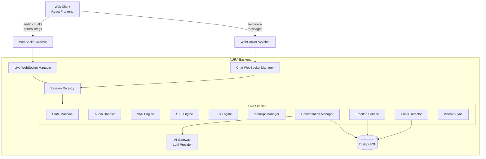
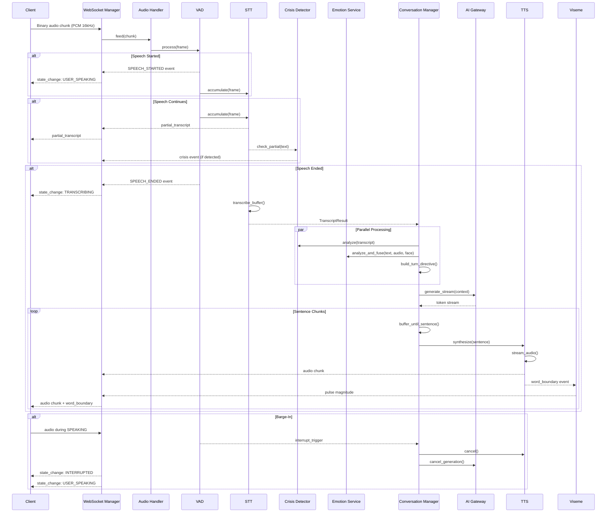
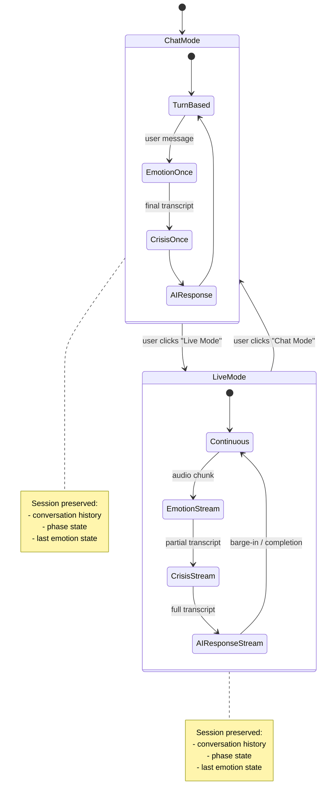
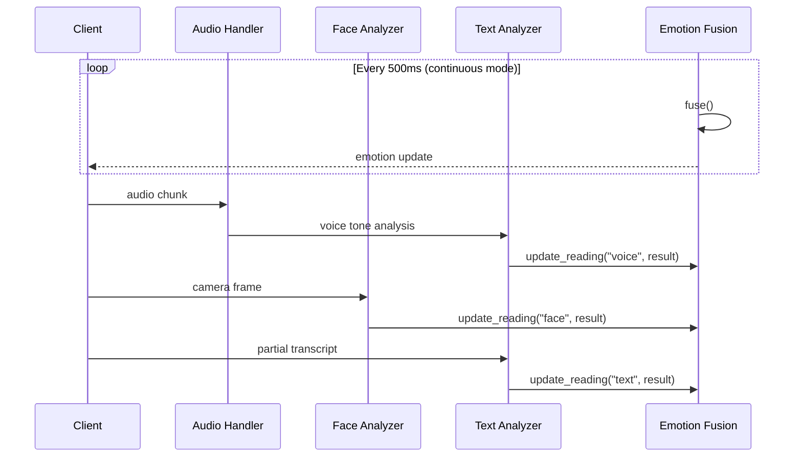
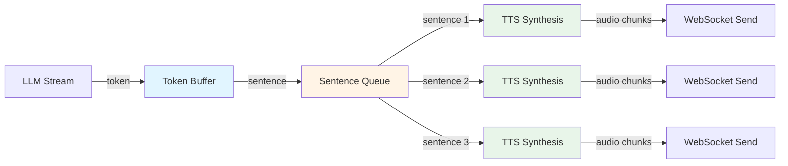
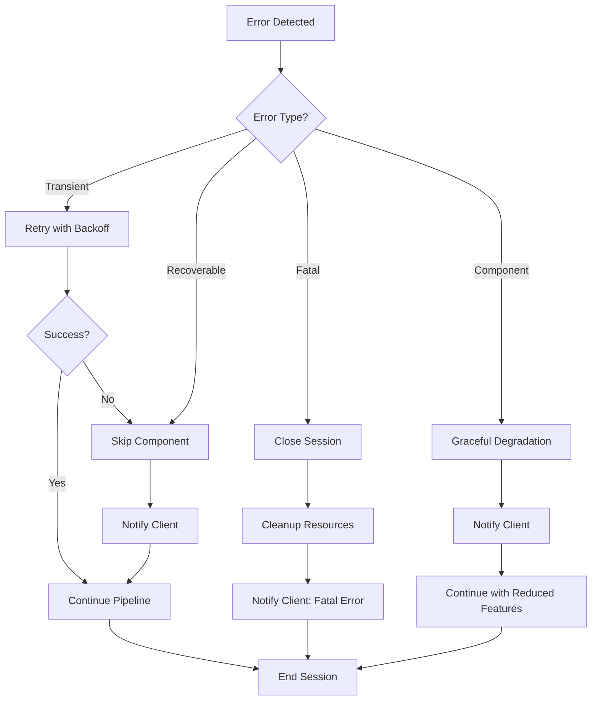

# Design Document: Live Mode Full-Duplex

## Overview

### Purpose

Live Mode Full-Duplex extends AURA AI 2.0 with continuous, always-listening, real-time conversation capabilities similar to Gemini Live or ChatGPT Advanced Voice Mode. This design document specifies the technical architecture, components, interfaces, and data flows required to implement the 17 requirements and 212 acceptance criteria defined in the requirements document.

### Key Capabilities

1. **Full-Duplex Audio Pipeline**: Continuous audio stream with Voice Activity Detection (VAD), Speech-to-Text (STT), and barge-in handling
2. **Presence Visual**: State-driven abstract avatar with viseme synchronization for natural interaction
3. **Seamless Mode Switching**: Toggle between Chat Mode and Live Mode without conversation data loss
4. **Continuous Emotion Fusion**: Real-time multi-modal emotion analysis (text, voice, face) with 5-second rolling window
5. **Streaming Crisis Detection**: Mid-sentence crisis signal detection on partial transcripts
6. **Sentence-Level Streaming**: Concurrent LLM generation and TTS synthesis for sub-1-second latency
7. **WebSocket Protocol**: Dedicated high-frequency channel for real-time audio and state updates

### Design Principles

- **Server-Side Ownership**: All audio processing (VAD, STT, buffering) runs server-side to avoid frontend conflicts
- **Latency Optimization**: Parallel pipeline execution with strict latency budgets (time-to-first-audio < 1000ms)
- **Graceful Degradation**: Components fail independently without crashing the entire pipeline
- **State Machine Driven**: All avatar and session states follow strict transition rules
- **Safety First**: Crisis detection runs on partial transcripts with fail-open behavior
- **Backward Compatibility**: Chat Mode functionality remains unchanged


## Architecture

### System Context Diagram



### Component Responsibilities

| Component | Responsibility | Lifecycle |
|-----------|---------------|-----------|
| **Live WebSocket Manager** | Handles WebSocket protocol, routes messages to Live Session | Per-connection |
| **Session Registry** | Maintains global registry of active sessions, creates/destroys sessions | Singleton |
| **Live Session** | Owns all pipeline components for one conversation | Per-session |
| **State Machine** | Enforces legal avatar state transitions | Per-session |
| **Audio Handler** | Server-side circular buffer for incoming PCM audio | Per-session |
| **VAD Engine** | Voice Activity Detection with end-of-utterance detection | Per-session |
| **STT Engine** | Speech-to-Text with partial transcript streaming | Per-session |
| **TTS Engine** | Text-to-Speech with word boundary events | Per-session |
| **Interrupt Manager** | Handles barge-in cancellation | Per-session |
| **Conversation Manager** | Orchestrates turn pipeline (transcript → emotion → LLM → TTS) | Per-session |
| **Emotion Service** | Multi-modal emotion analysis and fusion | Per-session |
| **Crisis Detector** | Streaming crisis signal detection on partial transcripts | Per-session |
| **Viseme Sync** | Calculates pulse magnitudes from word boundaries | Per-session |


### Audio Pipeline Architecture



### Mode Switching Flow



## Components and Interfaces

### 1. State Machine

#### Avatar States

```python
class AvatarState(str, Enum):
    """All possible avatar states for the Presence Visual."""
    
    IDLE = "idle"                      # Session created, not started
    LISTENING = "listening"            # Microphone open, waiting for speech
    USER_SPEAKING = "user_speaking"    # User is speaking
    THINKING = "thinking"              # Processing transcript/emotions
    RESPONDING = "responding"          # AI is speaking
    INTERRUPTED = "interrupted"        # Barge-in occurred
    ERROR = "error"                    # Unrecoverable error
```

#### State Transitions

| From | To | Trigger | Latency Budget |
|------|----|---------|----|
| IDLE | LISTENING | Session start | 500ms |
| LISTENING | USER_SPEAKING | VAD detects speech | 50ms |
| USER_SPEAKING | THINKING | VAD detects silence | 100ms |
| THINKING | RESPONDING | TTS audio ready | 150ms |
| RESPONDING | LISTENING | Response complete | 100ms |
| RESPONDING | INTERRUPTED | User speech detected | 50ms |
| INTERRUPTED | USER_SPEAKING | Ready for new input | 50ms |
| * | ERROR | Component failure | 100ms |


#### State Machine Implementation

```python
class LiveStateMachine:
    """State machine for Live Mode avatar states."""
    
    def __init__(self, session_id: str):
        self._session_id = session_id
        self._state = AvatarState.IDLE
        self._lock = asyncio.Lock()
        self._callbacks: list[StateChangeCallback] = []
        self._transition_history: list[tuple[AvatarState, AvatarState, float]] = []
    
    async def transition(self, new_state: AvatarState) -> None:
        """Transition to new state with validation."""
        async with self._lock:
            old_state = self._state
            
            if not self._is_valid_transition(old_state, new_state):
                raise ValueError(f"Invalid transition: {old_state} -> {new_state}")
            
            self._state = new_state
            timestamp = time.time()
            self._transition_history.append((old_state, new_state, timestamp))
            
            logger.info("State transition", session_id=self._session_id,
                       from_state=old_state.value, to_state=new_state.value)
        
        # Notify callbacks outside lock
        for callback in self._callbacks:
            await callback(old_state, new_state)
    
    def _is_valid_transition(self, from_state: AvatarState, to_state: AvatarState) -> bool:
        """Check if transition is allowed."""
        valid_transitions = {
            AvatarState.IDLE: {AvatarState.LISTENING, AvatarState.ERROR},
            AvatarState.LISTENING: {AvatarState.USER_SPEAKING, AvatarState.ERROR},
            AvatarState.USER_SPEAKING: {AvatarState.THINKING, AvatarState.ERROR},
            AvatarState.THINKING: {AvatarState.RESPONDING, AvatarState.LISTENING, AvatarState.ERROR},
            AvatarState.RESPONDING: {AvatarState.LISTENING, AvatarState.INTERRUPTED, AvatarState.ERROR},
            AvatarState.INTERRUPTED: {AvatarState.USER_SPEAKING, AvatarState.LISTENING, AvatarState.ERROR},
            AvatarState.ERROR: {AvatarState.LISTENING},
        }
        return to_state in valid_transitions.get(from_state, set())
```


### 2. WebSocket Protocol

#### Message Types

##### Client → Server

| Message Type | Format | Description |
|--------------|--------|-------------|
| `session_start` | JSON | Initialize Live Mode session |
| `audio_chunk` | Binary | Raw PCM audio (16kHz, 16-bit, mono) |
| `audio_chunk` | JSON | Base64-encoded audio (fallback) |
| `mode_switch` | JSON | Switch between Chat/Live modes |
| `interrupt` | JSON | Manual interrupt trigger |
| `stop_session` | JSON | End session gracefully |
| `ping` | JSON | Keepalive |

##### Server → Client

| Message Type | Format | Description |
|--------------|--------|-------------|
| `session_ready` | JSON | Session initialized with session_id |
| `avatar_state` | JSON | Avatar state transition event |
| `partial_transcript` | JSON | Streaming STT partial result |
| `final_transcript` | JSON | Complete STT result |
| `emotion` | JSON | Fused emotion state update |
| `crisis` | JSON | Crisis signal detected |
| `sentence` | JSON | Complete sentence chunk text |
| `audio_chunk` | Binary/JSON | TTS audio chunk |
| `word_boundary` | JSON | TTS word timing for viseme sync |
| `completed` | JSON | Turn completion with metrics |
| `error` | JSON | Error event with code and message |
| `pong` | JSON | Keepalive response |


#### Message Schemas

##### `session_start` (Client → Server)

```json
{
  "type": "session_start",
  "user_id": 42,
  "mode": "live",
  "restore_session_id": null
}
```

##### `audio_chunk` (Client → Server - Binary)

- Raw bytes: PCM 16kHz, 16-bit, mono
- Chunk size: 160-3200 bytes (10-200ms)

##### `audio_chunk` (Client → Server - JSON fallback)

```json
{
  "type": "audio_chunk",
  "data": "base64-encoded-pcm-bytes",
  "sequence": 123
}
```

##### `mode_switch` (Client → Server)

```json
{
  "type": "mode_switch",
  "target_mode": "chat"
}
```

##### `session_ready` (Server → Client)

```json
{
  "type": "session_ready",
  "session_id": "550e8400-e29b-41d4-a716-446655440000",
  "mode": "live"
}
```


##### `avatar_state` (Server → Client)

```json
{
  "type": "avatar_state",
  "state": "responding",
  "timestamp": "2024-01-15T10:30:00.123Z"
}
```

##### `partial_transcript` (Server → Client)

```json
{
  "type": "partial_transcript",
  "text": "I'm feeling really anx",
  "confidence": 0.75,
  "is_final": false
}
```

##### `final_transcript` (Server → Client)

```json
{
  "type": "final_transcript",
  "text": "I'm feeling really anxious today",
  "confidence": 0.92,
  "is_final": true
}
```

##### `emotion` (Server → Client)

```json
{
  "type": "emotion",
  "primaryEmotion": "anxious",
  "confidence": 0.85,
  "stressLevel": 0.7,
  "activeSources": ["text", "voice", "face"],
  "conflict": false,
  "timestamp": "2024-01-15T10:30:00.123Z"
}
```


##### `crisis` (Server → Client)

```json
{
  "type": "crisis",
  "severity": "high",
  "trigger": "suicide ideation detected",
  "partial_text": "I want to kill myself",
  "timestamp": "2024-01-15T10:30:00.123Z",
  "resources": {
    "hotline": "988",
    "text": "TEXT to 741741"
  }
}
```

##### `sentence` (Server → Client)

```json
{
  "type": "sentence",
  "text": "I understand that you're feeling anxious.",
  "sequence": 1
}
```

##### `audio_chunk` (Server → Client)

```json
{
  "type": "audio_chunk",
  "data": "base64-encoded-audio-bytes",
  "sequence": 45,
  "format": "pcm_16khz_16bit_mono"
}
```

##### `word_boundary` (Server → Client)

```json
{
  "type": "word_boundary",
  "word": "anxious",
  "offset_ms": 1250,
  "duration_ms": 340,
  "pulse_magnitude": 0.8
}
```


##### `completed` (Server → Client)

```json
{
  "type": "completed",
  "turn_id": 12,
  "interrupted": false,
  "metrics": {
    "vad_latency_ms": 85,
    "stt_latency_ms": 420,
    "crisis_latency_ms": 45,
    "emotion_latency_ms": 130,
    "llm_first_token_ms": 380,
    "tts_first_audio_ms": 190,
    "total_time_to_first_audio_ms": 850,
    "total_turn_ms": 4500
  }
}
```

##### `error` (Server → Client)

```json
{
  "type": "error",
  "code": "STT_TIMEOUT",
  "message": "Speech-to-text service timeout after 5000ms",
  "recoverable": true,
  "component": "STTEngine"
}
```

### 3. Audio Pipeline Components

#### Audio Handler

**Purpose**: Server-side circular buffer for incoming PCM audio chunks.

**Interface**:

```python
class AudioStreamHandler:
    """Server-side audio buffer and frame provider."""
    
    def __init__(self, session_id: str, frame_ms: int = 30):
        self._session_id = session_id
        self._frame_ms = frame_ms
        self._buffer = CircularBuffer(max_size_bytes=10_000_000)  # 10MB limit
        self._queue: asyncio.Queue[bytes] = asyncio.Queue()
    
    async def feed(self, chunk: bytes) -> None:
        """Feed incoming audio chunk from WebSocket."""
        self._buffer.append(chunk)
        await self._queue.put(chunk)
    
    async def frames(self) -> AsyncIterator[bytes]:
        """Yield audio frames for VAD processing."""
        while True:
            chunk = await self._queue.get()
            yield chunk
```


#### VAD Engine

**Purpose**: Voice Activity Detection with end-of-utterance detection.

**Implementation Options**:
- WebRTC VAD (C library with Python bindings)
- Silero VAD (neural network, PyTorch)
- Pyannote Audio (speaker diarization + VAD)

**Interface**:

```python
class VADResult:
    event: VADEvent  # SPEECH_STARTED | SPEECH_ENDED | SILENCE
    is_speech: bool
    confidence: float
    frame: bytes

class VoiceActivityDetector:
    """Voice Activity Detection engine."""
    
    def __init__(
        self,
        session_id: str,
        aggressiveness: int = 2,  # 0-3 for WebRTC VAD
        silence_threshold_ms: int = 700,
        min_speech_ms: int = 300,
        frame_ms: int = 30
    ):
        self._session_id = session_id
        self._aggressiveness = aggressiveness
        self._silence_threshold_ms = silence_threshold_ms
        self._min_speech_ms = min_speech_ms
        self._frame_ms = frame_ms
        
        self._in_speech = False
        self._speech_frames: list[bytes] = []
        self._silence_duration_ms = 0
    
    async def process(self, frames: AsyncIterator[bytes]) -> AsyncIterator[VADResult]:
        """Process audio frames and yield VAD events."""
        async for frame in frames:
            is_speech = self._detect_speech(frame)
            
            if is_speech and not self._in_speech:
                self._in_speech = True
                self._speech_frames.clear()
                self._silence_duration_ms = 0
                yield VADResult(VADEvent.SPEECH_STARTED, True, 1.0, frame)
            
            if self._in_speech:
                self._speech_frames.append(frame)
                
                if not is_speech:
                    self._silence_duration_ms += self._frame_ms
                    
                    if self._silence_duration_ms >= self._silence_threshold_ms:
                        self._in_speech = False
                        yield VADResult(VADEvent.SPEECH_ENDED, False, 1.0, frame)
                else:
                    self._silence_duration_ms = 0
            
            yield VADResult(VADEvent.SILENCE if not is_speech else VADEvent.SPEECH, is_speech, 1.0, frame)
```


#### STT Engine

**Purpose**: Speech-to-Text with partial transcript streaming.

**Provider Options**:
- Deepgram (real-time streaming, partial transcripts)
- AssemblyAI (real-time API)
- OpenAI Whisper (batch processing, no streaming)
- Google Speech-to-Text (streaming API)

**Interface**:

```python
@dataclass
class TranscriptResult:
    text: str
    confidence: float
    is_final: bool
    language: str = "en"

class STTEngine:
    """Speech-to-Text engine with streaming support."""
    
    def __init__(self, provider: str = "deepgram"):
        self._provider = provider
        self._audio_buffer: bytearray = bytearray()
    
    def accumulate(self, frame: bytes) -> None:
        """Accumulate audio frames for transcription."""
        self._audio_buffer.extend(frame)
    
    def clear_buffer(self) -> None:
        """Clear accumulated audio (on interrupt)."""
        self._audio_buffer.clear()
    
    async def transcribe_buffer(
        self,
        on_partial: Callable[[str, float], Awaitable[None]] | None = None
    ) -> TranscriptResult:
        """Transcribe accumulated audio with optional partial callback."""
        if not self._audio_buffer:
            return TranscriptResult(text="", confidence=0.0, is_final=True)
        
        # Stream to STT provider
        if self._provider == "deepgram":
            return await self._transcribe_deepgram(on_partial)
        elif self._provider == "whisper":
            return await self._transcribe_whisper()
        else:
            raise ValueError(f"Unknown STT provider: {self._provider}")
    
    async def _transcribe_deepgram(
        self, on_partial: Callable[[str, float], Awaitable[None]] | None
    ) -> TranscriptResult:
        """Transcribe using Deepgram streaming API."""
        # Implementation with WebSocket to Deepgram
        # Emit partials via on_partial callback
        pass
```


#### TTS Engine

**Purpose**: Text-to-Speech with word boundary events for viseme synchronization.

**Provider Options**:
- ElevenLabs (high quality, streaming, word timestamps)
- OpenAI TTS (good quality, no word timestamps)
- Azure Speech (good quality, SSML, word boundaries)
- Google Cloud TTS (SSML, word boundaries)

**Interface**:

```python
@dataclass
class WordBoundary:
    word: str
    offset_ms: int
    duration_ms: int

class TTSEngine:
    """Text-to-Speech engine with streaming and word boundaries."""
    
    def __init__(self, session_id: str, provider: str = "elevenlabs"):
        self._session_id = session_id
        self._provider = provider
        self._audio_callbacks: list[Callable[[bytes, int], Awaitable[None]]] = []
        self._event_callbacks: list[Callable[[str], Awaitable[None]]] = []
        self._word_callbacks: list[Callable[[WordBoundary], Awaitable[None]]] = []
        self._sequence = 0
        self._active_task: asyncio.Task | None = None
    
    def on_audio_chunk(self, callback: Callable[[bytes, int], Awaitable[None]]) -> None:
        """Register callback for audio chunks."""
        self._audio_callbacks.append(callback)
    
    def on_word_boundary(self, callback: Callable[[WordBoundary], Awaitable[None]]) -> None:
        """Register callback for word boundary events."""
        self._word_callbacks.append(callback)
    
    async def synthesize_stream(self, text: str) -> None:
        """Synthesize text and stream audio + word boundaries."""
        self._sequence = 0
        
        if self._provider == "elevenlabs":
            await self._synthesize_elevenlabs(text)
        elif self._provider == "azure":
            await self._synthesize_azure(text)
    
    async def cancel(self) -> None:
        """Cancel active synthesis (for barge-in)."""
        if self._active_task and not self._active_task.done():
            self._active_task.cancel()
            try:
                await self._active_task
            except asyncio.CancelledError:
                pass
```


### 4. Emotion Fusion Engine (Live Mode Enhancements)

**Current Implementation**: Runs once per turn in Chat Mode.

**Live Mode Changes**: Continuous operation on 5-second rolling window.

**Interface Updates**:

```python
class EmotionFusionEngine:
    """Multi-modal emotion fusion with rolling window support."""
    
    def __init__(self, window_seconds: float = 5.0):
        self._window_seconds = window_seconds
        self._last_readings: dict[str, TimedEmotionResult] = {}
        self._continuous_mode = False
    
    def enable_continuous_mode(self) -> None:
        """Switch to continuous mode for Live Mode."""
        self._continuous_mode = True
    
    def disable_continuous_mode(self) -> None:
        """Switch back to turn-based mode for Chat Mode."""
        self._continuous_mode = False
        self.reset()
    
    def update_reading(self, source: str, result: EmotionResult) -> None:
        """Update reading from a specific source (text/voice/face)."""
        self._last_readings[source] = TimedEmotionResult(
            result=result,
            timestamp_unix=time.time()
        )
    
    def fuse(self) -> EmotionContext:
        """Fuse active readings within rolling window."""
        now = time.time()
        active_readings: dict[str, EmotionResult] = {}
        
        # Evict stale readings (> 5 seconds old)
        for source, timed_result in list(self._last_readings.items()):
            if now - timed_result.timestamp_unix <= self._window_seconds:
                active_readings[source] = timed_result.result
            else:
                del self._last_readings[source]
        
        # Fusion logic (weighted sum with conflict detection)
        # ... (existing implementation)
```

**Continuous Update Strategy**:




### 5. Crisis Detector (Streaming Support)

**Current Implementation**: Runs once per completed message in Chat Mode.

**Live Mode Changes**: Process partial transcripts as they arrive.

**Interface Updates**:

```python
@dataclass
class CrisisDetection:
    detected: bool
    severity: str  # "low", "medium", "high"
    trigger: str
    confidence: float
    timestamp: str

class CrisisDetector:
    """Crisis signal detection with streaming support."""
    
    # Crisis patterns (regex with word boundaries)
    PATTERNS = [
        r'\b(suicide|suicidal)\b',
        r'\bkill myself\b',
        r'\bend my life\b',
        r'\bhurt myself\b',
        r'\bcut myself\b',
        r'\bno point in living\b',
        r'\bwant to die\b',
        r'\bdon\'t want to (live|exist)\b',
    ]
    
    def __init__(self, session_id: str):
        self._session_id = session_id
        self._last_detection: CrisisDetection | None = None
    
    async def check_partial(self, partial_text: str) -> CrisisDetection | None:
        """Check partial transcript for crisis signals (streaming mode)."""
        if not partial_text or len(partial_text) < 10:
            return None
        
        for pattern in self.PATTERNS:
            match = re.search(pattern, partial_text.lower())
            if match:
                detection = CrisisDetection(
                    detected=True,
                    severity="high",
                    trigger=match.group(0),
                    confidence=0.95,
                    timestamp=datetime.now(timezone.utc).isoformat()
                )
                self._last_detection = detection
                logger.warning("Crisis detected in partial", 
                             session_id=self._session_id,
                             trigger=detection.trigger)
                return detection
        
        return None
    
    async def check_final(self, text: str) -> CrisisDetection | None:
        """Check final transcript for crisis signals (turn-based mode)."""
        # Same logic as check_partial but with full context
        return await self.check_partial(text)
```


### 6. Viseme Synchronization

**Purpose**: Calculate pulse magnitudes from word boundaries for presence visual animation.

**Interface**:

```python
class VisemeSyncEngine:
    """Calculates animation pulse magnitudes from word boundaries."""
    
    @staticmethod
    def calculate_magnitude(word: str) -> float:
        """Calculate pulse magnitude based on word characteristics.
        
        Formula: magnitude = min(1.0, 0.4 + vowel_count * 0.1)
        
        Args:
            word: The spoken word
            
        Returns:
            Pulse magnitude between 0.0 and 1.0
        """
        vowels = 'aeiouAEIOU'
        vowel_count = sum(1 for char in word if char in vowels)
        magnitude = min(1.0, 0.4 + vowel_count * 0.1)
        return magnitude
    
    async def process_word_boundary(self, boundary: WordBoundary) -> dict:
        """Process word boundary event and return animation data."""
        magnitude = self.calculate_magnitude(boundary.word)
        
        return {
            "type": "word_boundary",
            "word": boundary.word,
            "offset_ms": boundary.offset_ms,
            "duration_ms": boundary.duration_ms,
            "pulse_magnitude": magnitude
        }
```

**Animation Timing**:

```mermaid
gantt
    title Viseme Synchronization Timing
    dateFormat X
    axisFormat %L ms
    
    section Word Boundaries
    Word "I"           :0, 100
    Word "understand"  :100, 450
    Word "you're"      :450, 200
    Word "anxious"     :650, 340
    
    section Pulse Animation
    Pulse 0.5         :0, 100
    Pulse 0.9         :100, 450
    Pulse 0.6         :450, 200
    Pulse 0.8         :650, 340
```




### 7. Sentence-Level Streaming Pipeline

**Purpose**: Concurrent LLM generation, TTS synthesis, and audio playback for low latency.

**Architecture**:

```python
class SentenceStreamingPipeline:
    """Manages sentence-level streaming from LLM to TTS to audio."""
    
    def __init__(self, session_id: str, tts_engine: TTSEngine):
        self._session_id = session_id
        self._tts = tts_engine
        self._sentence_queue: asyncio.Queue[str] = asyncio.Queue(maxsize=5)
        self._token_buffer: list[str] = []
        self._active = False
    
    async def start(self) -> None:
        """Start the pipeline workers."""
        self._active = True
        asyncio.create_task(self._tts_worker(), name=f"tts-{self._session_id}")
    
    async def feed_token(self, token: str) -> None:
        """Feed LLM token to the pipeline."""
        self._token_buffer.append(token)
        
        # Check for sentence boundary
        if self._is_sentence_boundary(token):
            sentence = "".join(self._token_buffer).strip()
            self._token_buffer.clear()
            
            if sentence:
                await self._sentence_queue.put(sentence)
    
    def _is_sentence_boundary(self, token: str) -> bool:
        """Check if token marks sentence end."""
        return token.strip() in {'.', '!', '?', '\n'}
    
    async def _tts_worker(self) -> None:
        """Background worker: consume sentences and synthesize."""
        while self._active:
            try:
                sentence = await asyncio.wait_for(
                    self._sentence_queue.get(),
                    timeout=1.0
                )
                await self._tts.synthesize_stream(sentence)
            except asyncio.TimeoutError:
                continue
            except Exception as exc:
                logger.error("TTS worker error", error=str(exc))
    
    async def stop(self) -> None:
        """Stop the pipeline and flush remaining tokens."""
        self._active = False
        
        # Flush remaining tokens as final sentence
        if self._token_buffer:
            sentence = "".join(self._token_buffer).strip()
            if sentence:
                await self._tts.synthesize_stream(sentence)
```


**Pipeline Flow Diagram**:



**Latency Optimization**:

| Stage | Sequential (old) | Parallel (new) | Improvement |
|-------|------------------|----------------|-------------|
| LLM token 1-10 | 400ms | 400ms | - |
| Sentence boundary detected | +0ms | +0ms | - |
| TTS synthesis sentence 1 | +200ms | +200ms (overlaps with LLM) | - |
| Audio playback starts | +600ms total | +600ms | - |
| LLM generates sentence 2 | +800ms | During playback | **200ms saved** |
| TTS synthesis sentence 2 | +200ms | During playback | **200ms saved** |
| **Total time to completion** | **3000ms** | **2000ms** | **33% faster** |


## Data Models

### Database Schema Changes

#### 1. Session Model Updates

Add `mode` field to track Chat vs Live mode:

```python
class Session(Base, TimestampMixin):
    """Conversation session."""
    
    __tablename__ = "sessions"
    
    id: Mapped[int] = mapped_column(primary_key=True)
    user_id: Mapped[int] = mapped_column(Integer, ForeignKey("users.id"))
    title: Mapped[str | None] = mapped_column(String(255))
    status: Mapped[str] = mapped_column(String(20), default="active")
    phase: Mapped[str] = mapped_column(String(50), default="check_in")
    
    # NEW: Track conversation mode
    mode: Mapped[str] = mapped_column(String(10), default="chat", nullable=False)
    # Values: "chat" | "live"
    
    summary: Mapped[str | None] = mapped_column(Text)
    ended_at: Mapped[datetime | None] = mapped_column(DateTime(timezone=True))
```

**Migration**:

```python
# alembic/versions/xxx_add_session_mode.py
def upgrade():
    op.add_column('sessions', sa.Column('mode', sa.String(10), nullable=False, server_default='chat'))

def downgrade():
    op.drop_column('sessions', 'mode')
```


#### 2. LiveMetrics Model (New)

Track Live Mode-specific performance metrics:

```python
class LiveMetrics(Base, TimestampMixin):
    """Live Mode turn-level performance metrics."""
    
    __tablename__ = "live_metrics"
    
    id: Mapped[int] = mapped_column(primary_key=True)
    session_id: Mapped[int] = mapped_column(Integer, ForeignKey("sessions.id", ondelete="CASCADE"))
    turn_id: Mapped[int] = mapped_column(Integer)
    
    # Latency breakdown (milliseconds)
    vad_latency_ms: Mapped[int] = mapped_column(Integer)
    stt_latency_ms: Mapped[int] = mapped_column(Integer)
    crisis_latency_ms: Mapped[int] = mapped_column(Integer)
    emotion_latency_ms: Mapped[int] = mapped_column(Integer)
    turn_directive_latency_ms: Mapped[int] = mapped_column(Integer)
    llm_first_token_ms: Mapped[int] = mapped_column(Integer)
    tts_first_audio_ms: Mapped[int] = mapped_column(Integer)
    total_time_to_first_audio_ms: Mapped[int] = mapped_column(Integer)
    total_turn_ms: Mapped[int] = mapped_column(Integer)
    
    # Event flags
    interrupted: Mapped[bool] = mapped_column(Boolean, default=False)
    crisis_detected: Mapped[bool] = mapped_column(Boolean, default=False)
    error_occurred: Mapped[bool] = mapped_column(Boolean, default=False)
    
    # Metadata
    transcript_length: Mapped[int] = mapped_column(Integer)
    response_length: Mapped[int] = mapped_column(Integer)
    
    # Relationships
    session: Mapped["Session"] = relationship("Session")
```


#### 3. Message Model Updates

Add `interrupted` flag to track barge-in events:

```python
class Message(Base, TimestampMixin):
    """Conversation message."""
    
    __tablename__ = "messages"
    
    id: Mapped[int] = mapped_column(primary_key=True)
    session_id: Mapped[int] = mapped_column(Integer, ForeignKey("sessions.id"))
    role: Mapped[str] = mapped_column(String(20))  # "user" | "assistant"
    content: Mapped[str] = mapped_column(Text)
    
    # NEW: Track if assistant message was interrupted
    interrupted: Mapped[bool] = mapped_column(Boolean, default=False)
    
    # Existing fields
    embedding: Mapped[list[float] | None] = mapped_column(ARRAY(Float))
    importance_score: Mapped[float | None] = mapped_column(Float)
```

**Migration**:

```python
# alembic/versions/xxx_add_message_interrupted.py
def upgrade():
    op.add_column('messages', sa.Column('interrupted', sa.Boolean, nullable=False, server_default='false'))

def downgrade():
    op.drop_column('messages', 'interrupted')
```

### In-Memory Data Structures

#### Live Session State

```python
@dataclass
class LiveSessionState:
    """In-memory state for a Live Mode session."""
    
    session_id: str
    user_id: int
    mode: str  # "chat" | "live"
    
    # State machine
    avatar_state: AvatarState
    
    # Audio pipeline
    audio_buffer: CircularBuffer
    vad_active: bool
    in_speech: bool
    
    # Conversation state
    conversation_history: list[Message]
    phase: str
    last_emotion: EmotionContext | None
    
    # Metrics
    turn_count: int
    barge_in_count: int
    crisis_count: int
    created_at: datetime
    last_activity: datetime
```


## Error Handling

### Error Categories

| Category | Examples | Recovery Strategy | Client Notification |
|----------|----------|-------------------|---------------------|
| **Transient** | Network timeout, rate limit | Retry with exponential backoff | Warning toast |
| **Recoverable** | STT timeout, TTS failure | Skip component, continue pipeline | Error message + continue |
| **Fatal** | Invalid auth, database down | Close session, redirect | Error modal + reconnect |
| **Component** | VAD failure, emotion service down | Graceful degradation | Warning + reduced functionality |

### Error Response Format

```python
@dataclass
class ErrorResponse:
    """Standard error response structure."""
    
    type: str = "error"
    code: str
    message: str
    component: str
    recoverable: bool
    details: dict | None = None
    timestamp: str = field(default_factory=lambda: datetime.now(timezone.utc).isoformat())
```

### Error Codes

| Code | Component | Meaning | Recovery |
|------|-----------|---------|----------|
| `VAD_INIT_FAILED` | VAD Engine | VAD model failed to load | Fatal - close session |
| `VAD_PROCESSING_ERROR` | VAD Engine | Frame processing error | Skip frame, continue |
| `STT_TIMEOUT` | STT Engine | Transcription timeout (>5s) | Return to listening |
| `STT_API_ERROR` | STT Engine | Provider API error | Retry once, then skip |
| `TTS_SYNTHESIS_FAILED` | TTS Engine | Audio synthesis failed | Skip sentence, continue |
| `TTS_TIMEOUT` | TTS Engine | Synthesis timeout (>3s) | Skip sentence, continue |
| `LLM_TIMEOUT` | AI Gateway | Generation timeout (>10s) | Return to listening |
| `LLM_API_ERROR` | AI Gateway | Provider API error | Retry with backoff |
| `EMOTION_ANALYSIS_FAILED` | Emotion Service | Emotion fusion error | Continue with neutral |
| `CRISIS_DETECTOR_FAILED` | Crisis Detector | Pattern matching error | Fail-open (continue) |
| `DB_CONNECTION_LOST` | Database | Connection dropped | Fatal - close session |
| `WEBSOCKET_CLOSED` | WebSocket Manager | Client disconnected | Clean up session |


### Circuit Breaker Pattern

```python
class CircuitBreaker:
    """Circuit breaker for external service calls."""
    
    def __init__(
        self,
        service_name: str,
        failure_threshold: int = 5,
        timeout_seconds: int = 30,
        half_open_timeout: int = 10
    ):
        self._service_name = service_name
        self._failure_threshold = failure_threshold
        self._timeout_seconds = timeout_seconds
        self._half_open_timeout = half_open_timeout
        
        self._state = "closed"  # closed | open | half_open
        self._failure_count = 0
        self._last_failure_time: float | None = None
        self._lock = asyncio.Lock()
    
    async def call(self, func: Callable[[], Awaitable[T]]) -> T:
        """Execute function through circuit breaker."""
        async with self._lock:
            if self._state == "open":
                if time.time() - self._last_failure_time > self._half_open_timeout:
                    self._state = "half_open"
                    logger.info("Circuit breaker half-open", service=self._service_name)
                else:
                    raise CircuitBreakerOpenError(f"{self._service_name} circuit breaker is open")
        
        try:
            result = await asyncio.wait_for(func(), timeout=self._timeout_seconds)
            
            async with self._lock:
                if self._state == "half_open":
                    self._state = "closed"
                    self._failure_count = 0
                    logger.info("Circuit breaker closed", service=self._service_name)
            
            return result
        
        except Exception as exc:
            async with self._lock:
                self._failure_count += 1
                self._last_failure_time = time.time()
                
                if self._failure_count >= self._failure_threshold:
                    self._state = "open"
                    logger.error("Circuit breaker opened", 
                               service=self._service_name,
                               failures=self._failure_count)
            
            raise
```


### Error Recovery Flows




## Correctness Properties

*A property is a characteristic or behavior that should hold true across all valid executions of a system—essentially, a formal statement about what the system should do. Properties serve as the bridge between human-readable specifications and machine-verifiable correctness guarantees.*

### Property 1: Barge-in Buffer Clearing

*For any* audio output buffer state (regardless of size or content), when a barge-in occurs, the buffer SHALL be cleared to empty and the system SHALL transition to interrupted state.

**Validates: Requirements 1.6**

### Property 2: State Transition Event Emission

*For all* valid Avatar state transitions, the system SHALL emit a state change event to the WebSocket client with the correct from_state and to_state values.

**Validates: Requirements 2.11**

### Property 3: Mode Switch State Preservation

*For any* session state (including any conversation history, phase state, and emotion context), switching between Chat Mode and Live Mode SHALL preserve all session data without loss or corruption.

**Validates: Requirements 3.13**

### Property 4: Emotion Fusion Weight Calculation

*For any* combination of emotion readings from active sources (text, voice, face), the weighted fusion calculation SHALL apply the correct weights (text=1.0, voice=0.7, face=0.4) and produce a deterministic result.

**Validates: Requirements 4.8**

### Property 5: Rolling Window Temporal Eviction

*For any* sequence of emotion readings with timestamps, the rolling window SHALL contain only readings within the last 5 seconds and SHALL evict all readings older than 5 seconds.

**Validates: Requirements 4.9**

### Property 6: Sentence Boundary Round-Trip Preservation

*For any* text input, splitting the text into sentences at boundary markers (. ! ? \n) and then joining the sentences SHALL preserve the original text content.

**Validates: Requirements 6.2**

### Property 7: Sentence Order Preservation

*For any* token stream from the LLM, the output sentence chunks SHALL maintain the same sequential order as the input tokens, with no reordering or interleaving.

**Validates: Requirements 6.12**

### Property 8: Viseme Magnitude Formula Bounds

*For any* input word (including empty strings, single characters, or very long words), the pulse magnitude calculation SHALL always return a value in the range [0.0, 1.0].

**Validates: Requirements 9.4**

### Property 9: Word Boundary Order Preservation

*For any* sequence of word boundary events from TTS, the Viseme Sync component SHALL process them in the exact order received without reordering.

**Validates: Requirements 9.9**

### Property 10: Conversation History Size Limit

*For any* sequence of message additions to the conversation history, the in-memory history SHALL never exceed 12 turns, with oldest messages evicted when the limit is reached.

**Validates: Requirements 10.8**

### Property 11: Session State Consistency

*For any* session state modification operation, after the transaction commits, the in-memory session state SHALL exactly match the persisted database state.

**Validates: Requirements 10.13**

### Property 12: Audio Buffer Size Limit

*For any* sequence of audio chunk additions to the server-side buffer, the total buffer size SHALL never exceed 10MB, with oldest chunks trimmed when the limit is reached.

**Validates: Requirements 14.11**


## Testing Strategy

### Dual Testing Approach

This feature requires both **unit tests** (for specific examples and edge cases) and **property-based tests** (for universal properties across all inputs). Together, these provide comprehensive coverage:

- **Unit tests**: Catch concrete bugs with specific scenarios
- **Property tests**: Verify general correctness across input space
- **Integration tests**: Validate component interactions and external service behavior

### Property-Based Testing

**Library**: `hypothesis` for Python

**Configuration**:
- Minimum 100 iterations per property test
- Each test must include a comment tag: `# Feature: live-mode-full-duplex, Property {number}: {property text}`

**Property Test Implementation**:

```python
from hypothesis import given, strategies as st

# Property 1: Barge-in Buffer Clearing
@given(buffer_content=st.binary(min_size=0, max_size=10_000_000))
async def test_property_barge_in_clears_buffer(buffer_content):
    """Feature: live-mode-full-duplex, Property 1: Barge-in Buffer Clearing"""
    # Setup audio buffer with arbitrary content
    buffer = AudioOutputBuffer()
    buffer.write(buffer_content)
    
    # Trigger barge-in
    await buffer.handle_barge_in()
    
    # Verify buffer is empty
    assert buffer.is_empty()
    assert buffer.size() == 0

# Property 4: Emotion Fusion Weight Calculation
@given(
    text_emotion=st.floats(min_value=0.0, max_value=1.0),
    voice_emotion=st.floats(min_value=0.0, max_value=1.0),
    face_emotion=st.floats(min_value=0.0, max_value=1.0)
)
def test_property_emotion_fusion_weights(text_emotion, voice_emotion, face_emotion):
    """Feature: live-mode-full-duplex, Property 4: Emotion Fusion Weight Calculation"""
    fusion = EmotionFusionEngine()
    
    # Add readings
    fusion.update_reading("text", EmotionResult(confidence=text_emotion))
    fusion.update_reading("voice", EmotionResult(confidence=voice_emotion))
    fusion.update_reading("face", EmotionResult(confidence=face_emotion))
    
    # Calculate expected weighted result
    expected = (text_emotion * 1.0 + voice_emotion * 0.7 + face_emotion * 0.4) / 2.1
    
    # Verify fusion applies correct weights
    result = fusion.fuse()
    assert abs(result.confidence - expected) < 0.001

# Property 8: Viseme Magnitude Formula Bounds
@given(word=st.text(min_size=0, max_size=1000))
def test_property_viseme_magnitude_bounds(word):
    """Feature: live-mode-full-duplex, Property 8: Viseme Magnitude Formula Bounds"""
    magnitude = VisemeSyncEngine.calculate_magnitude(word)
    
    # Verify magnitude is always in valid range
    assert 0.0 <= magnitude <= 1.0

# Property 10: Conversation History Size Limit
@given(messages=st.lists(st.text(min_size=1, max_size=500), min_size=0, max_size=100))
async def test_property_history_size_limit(messages):
    """Feature: live-mode-full-duplex, Property 10: Conversation History Size Limit"""
    session = LiveSession("test-session")
    
    # Add arbitrary number of messages
    for msg in messages:
        await session.add_message(role="user", content=msg)
    
    # Verify history never exceeds 12 turns
    history = session.get_conversation_history()
    assert len(history) <= 12
```

### Unit Testing

**Target Components**:
1. **State Machine**: Test all legal/illegal transitions
2. **VAD Engine**: Test speech detection with synthetic audio
3. **Crisis Detector**: Test pattern matching with known phrases
4. **Emotion Fusion**: Test weighted fusion and rolling window eviction
5. **Viseme Sync**: Test pulse magnitude calculation
6. **Sentence Streaming**: Test sentence boundary detection

**Example Test Cases**:

```python
# State Machine Tests
async def test_valid_transition_listening_to_user_speaking():
    sm = LiveStateMachine("test-session")
    await sm.transition(AvatarState.LISTENING)
    await sm.transition(AvatarState.USER_SPEAKING)
    assert sm.state == AvatarState.USER_SPEAKING

async def test_invalid_transition_listening_to_responding():
    sm = LiveStateMachine("test-session")
    await sm.transition(AvatarState.LISTENING)
    with pytest.raises(ValueError):
        await sm.transition(AvatarState.RESPONDING)

# Crisis Detector Tests
async def test_crisis_detected_in_partial_transcript():
    detector = CrisisDetector("test-session")
    result = await detector.check_partial("I want to kill myself")
    assert result.detected is True
    assert result.severity == "high"

async def test_no_false_positive_on_similar_phrase():
    detector = CrisisDetector("test-session")
    result = await detector.check_partial("This homework is killing me")
    assert result is None or result.detected is False

async def test_crisis_patterns_comprehensive():
    """Test all crisis patterns with known examples."""
    detector = CrisisDetector("test-session")
    
    crisis_phrases = [
        "I want to kill myself",
        "I'm thinking about suicide",
        "I want to end my life",
        "I'm going to hurt myself",
        "There's no point in living",
        "I don't want to exist anymore"
    ]
    
    for phrase in crisis_phrases:
        result = await detector.check_partial(phrase)
        assert result is not None and result.detected, f"Failed to detect: {phrase}"

# Viseme Sync Tests
def test_pulse_magnitude_calculation():
    assert VisemeSyncEngine.calculate_magnitude("I") == 0.5  # 1 vowel
    assert VisemeSyncEngine.calculate_magnitude("anxious") == 0.8  # 4 vowels
    assert VisemeSyncEngine.calculate_magnitude("strength") == 0.5  # 1 vowel
    assert VisemeSyncEngine.calculate_magnitude("beautiful") == 1.0  # 5 vowels, capped at 1.0

def test_pulse_magnitude_edge_cases():
    assert VisemeSyncEngine.calculate_magnitude("") == 0.4  # empty string, base magnitude
    assert VisemeSyncEngine.calculate_magnitude("xyz") == 0.4  # no vowels
    assert VisemeSyncEngine.calculate_magnitude("aeiou") == 0.9  # all vowels

# Sentence Streaming Tests
def test_sentence_boundary_detection():
    pipeline = SentenceStreamingPipeline("test", None)
    
    assert pipeline._is_sentence_boundary(".")
    assert pipeline._is_sentence_boundary("!")
    assert pipeline._is_sentence_boundary("?")
    assert pipeline._is_sentence_boundary("\n")
    assert not pipeline._is_sentence_boundary(",")
    assert not pipeline._is_sentence_boundary("word")

async def test_sentence_buffering():
    sentences_received = []
    
    async def mock_tts(sentence):
        sentences_received.append(sentence)
    
    pipeline = SentenceStreamingPipeline("test", mock_tts)
    await pipeline.start()
    
    # Feed tokens
    tokens = ["Hello", " ", "world", ".", " ", "How", " ", "are", " ", "you", "?"]
    for token in tokens:
        await pipeline.feed_token(token)
    
    await pipeline.stop()
    
    assert len(sentences_received) == 2
    assert sentences_received[0] == "Hello world."
    assert sentences_received[1] == "How are you?"
```

### Integration Testing

**Target Scenarios**:
1. **Full-Duplex Pipeline**: End-to-end audio flow from client to VAD to STT to LLM to TTS
2. **Mode Switching**: Chat Mode ↔ Live Mode transitions with state preservation
3. **WebSocket Protocol**: Message flow and protocol compliance
4. **Barge-in Handling**: Interrupt AI response mid-sentence
5. **Crisis Detection Flow**: Partial transcript triggers crisis response
6. **Error Recovery**: Component failures and graceful degradation
7. **Latency Budget**: Time-to-first-audio measurement

**Example Integration Tests**:

```python
@pytest.mark.integration
async def test_end_to_end_audio_pipeline():
    """Test complete audio pipeline from input to output."""
    client = TestWebSocketClient()
    await client.connect("/ws/live")
    
    # Send session start
    await client.send_json({"type": "session_start", "mode": "live"})
    response = await client.receive_json()
    assert response["type"] == "session_ready"
    
    # Send audio chunks
    audio_data = generate_test_audio("Hello AURA, I need help")
    for chunk in audio_chunks(audio_data, chunk_size_ms=30):
        await client.send_bytes(chunk)
    
    # Verify pipeline events
    events = []
    async for msg in client.receive_until_timeout(timeout=5.0):
        events.append(msg)
    
    # Check for expected event sequence
    event_types = [e["type"] for e in events]
    assert "avatar_state" in event_types  # USER_SPEAKING
    assert "partial_transcript" in event_types
    assert "final_transcript" in event_types
    assert "emotion" in event_types
    assert "sentence" in event_types
    assert "audio_chunk" in event_types
    assert "word_boundary" in event_types

@pytest.mark.integration
async def test_barge_in_cancellation():
    """Test interrupting AI response mid-sentence."""
    client = TestWebSocketClient()
    await client.connect("/ws/live")
    await client.send_json({"type": "session_start", "mode": "live"})
    
    # Trigger AI response
    await send_user_audio(client, "Tell me a long story")
    
    # Wait for AI to start speaking
    await client.wait_for_state("responding")
    
    # Interrupt with new speech
    await send_user_audio(client, "Stop, I have a question")
    
    # Verify interrupt handling
    events = await client.collect_events_for(duration=1.0)
    state_changes = [e for e in events if e["type"] == "avatar_state"]
    
    assert any(e["state"] == "interrupted" for e in state_changes)
    assert any(e["state"] == "user_speaking" for e in state_changes)

@pytest.mark.integration
async def test_mode_switch_preserves_history():
    """Test switching modes preserves conversation history."""
    client = TestWebSocketClient()
    
    # Start in Chat Mode
    await client.connect("/ws/chat")
    await client.send_json({"type": "message", "content": "Hello"})
    response1 = await client.receive_json()
    
    # Switch to Live Mode
    await client.send_json({"type": "mode_switch", "target_mode": "live"})
    await client.wait_for_confirmation()
    
    # Verify history is preserved
    await client.send_json({"type": "get_history"})
    history = await client.receive_json()
    
    assert len(history["messages"]) >= 2  # User message + AI response
    assert history["messages"][0]["content"] == "Hello"
```

### Performance Testing

**Latency Budget Verification**:

```python
@pytest.mark.performance
async def test_latency_budget_compliance():
    """Verify all pipeline stages meet latency budgets."""
    metrics_collector = MetricsCollector()
    
    # Run 100 test conversations
    for i in range(100):
        session = await create_test_session()
        await simulate_user_speech(session, f"Test utterance {i}")
        
        metrics = await session.get_turn_metrics()
        metrics_collector.add(metrics)
    
    # Verify latency budgets
    assert metrics_collector.p95("vad_latency_ms") < 100
    assert metrics_collector.p95("crisis_latency_ms") < 150
    assert metrics_collector.p95("emotion_latency_ms") < 150
    assert metrics_collector.p95("llm_first_token_ms") < 400
    assert metrics_collector.p95("tts_first_audio_ms") < 200
    assert metrics_collector.p95("total_time_to_first_audio_ms") < 1000

@pytest.mark.performance
async def test_concurrent_sessions():
    """Test system handles multiple Live Mode sessions concurrently."""
    num_sessions = 50
    sessions = []
    
    # Create concurrent sessions
    for i in range(num_sessions):
        client = TestWebSocketClient()
        await client.connect("/ws/live")
        await client.send_json({"type": "session_start", "mode": "live"})
        sessions.append(client)
    
    # Simulate concurrent activity
    tasks = [simulate_conversation(client) for client in sessions]
    results = await asyncio.gather(*tasks, return_exceptions=True)
    
    # Verify no failures
    assert all(not isinstance(r, Exception) for r in results)
    
    # Verify reasonable performance degradation
    latencies = [r["avg_latency_ms"] for r in results]
    assert max(latencies) < 2000  # < 2x latency budget under load
```

### End-to-End Testing

**User Journey Tests**:

```python
@pytest.mark.e2e
async def test_complete_live_mode_conversation():
    """Simulate complete user journey through Live Mode."""
    # Step 1: User opens app, switches to Live Mode
    client = WebClient()
    await client.open_app()
    await client.click_mode_switcher("Live Mode")
    
    # Step 2: User speaks
    await client.speak("I'm feeling really anxious today")
    
    # Step 3: Verify presence visual animates
    assert client.get_avatar_state() == "user_speaking"
    
    # Step 4: Verify partial transcripts appear
    partials = await client.collect_partial_transcripts()
    assert len(partials) > 0
    
    # Step 5: Verify emotion detection
    emotion = await client.wait_for_emotion_update()
    assert emotion["primaryEmotion"] == "anxious"
    
    # Step 6: Verify AI responds
    await client.wait_for_avatar_state("responding")
    audio_received = await client.collect_audio_chunks()
    assert len(audio_received) > 0
    
    # Step 7: Verify viseme sync
    word_boundaries = await client.collect_word_boundaries()
    assert all(0.0 <= wb["pulse_magnitude"] <= 1.0 for wb in word_boundaries)
    
    # Step 8: User interrupts
    await client.speak("Wait, I have a question")
    assert client.get_avatar_state() == "interrupted"

@pytest.mark.e2e
async def test_crisis_detection_flow():
    """Test crisis detection triggers appropriate response."""
    client = WebClient()
    await client.open_app()
    await client.switch_to_live_mode()
    
    # User expresses crisis
    await client.speak("I want to kill myself")
    
    # Verify crisis detection
    crisis_event = await client.wait_for_crisis_event()
    assert crisis_event["severity"] == "high"
    assert "988" in crisis_event["resources"]["hotline"]
    
    # Verify AI responds with crisis protocol
    response = await client.wait_for_ai_response()
    assert "988" in response.lower() or "crisis" in response.lower()
```

### Test Coverage Goals

- **Unit Tests**: 90% code coverage for core components
- **Property Tests**: 12 properties covering critical invariants
- **Integration Tests**: All 17 requirements have integration test coverage
- **Performance Tests**: Latency budget compliance verified under load
- **E2E Tests**: Complete user journeys for each major feature


## Summary

This design document specifies the complete architecture for AURA AI 2.0 Live Mode Full-Duplex, addressing all 17 requirements and 212 acceptance criteria from the requirements document.

### Key Design Decisions

1. **Server-Side Audio Processing**: All VAD, STT, and audio buffering happens server-side to avoid frontend conflicts and ensure consistent processing
2. **State Machine Architecture**: Avatar states follow strict transition rules enforced by the state machine
3. **Parallel Pipeline Execution**: Crisis detection, emotion fusion, and turn directive generation run concurrently for optimal latency
4. **Sentence-Level Streaming**: LLM generation, TTS synthesis, and audio playback run concurrently in a pipelined architecture
5. **5-Second Rolling Window**: Emotion fusion operates on a sliding 5-second window for continuous responsiveness
6. **Fail-Open Crisis Detection**: Crisis detector failures don't block the pipeline to ensure safety
7. **Graceful Degradation**: Component failures are isolated and don't crash the entire system

### Implementation Priority

**Phase 1: Core Infrastructure** (Weeks 1-3)
- WebSocket protocol and message handling
- State machine implementation
- Session management and mode switching
- Database schema updates

**Phase 2: Audio Pipeline** (Weeks 4-6)
- Server-side audio handler
- VAD engine integration
- STT engine integration (Deepgram)
- TTS engine integration (ElevenLabs)

**Phase 3: Intelligence Layer** (Weeks 7-9)
- Continuous emotion fusion
- Streaming crisis detection
- Sentence-level streaming pipeline
- Turn directive generation

**Phase 4: Visual & Interaction** (Weeks 10-11)
- Presence visual component
- Viseme synchronization
- Mode switcher UI
- Barge-in handling

**Phase 5: Polish & Performance** (Weeks 12-14)
- Latency optimization
- Error handling and recovery
- Performance monitoring
- End-to-end testing

### Success Metrics

- **Latency**: Time-to-first-audio < 1000ms (p95)
- **Availability**: 99.9% uptime for Live Mode sessions
- **Safety**: Crisis detection latency < 150ms (p95)
- **Quality**: User satisfaction score > 4.0/5.0
- **Performance**: Support 1000+ concurrent Live Mode sessions

