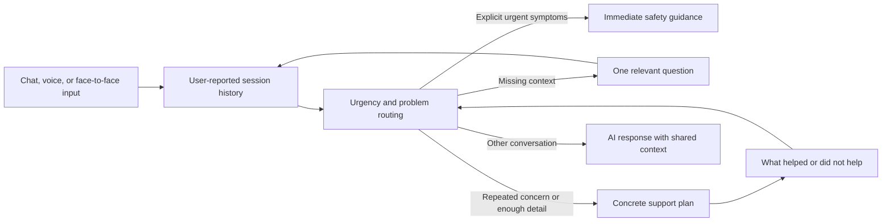

# Shared problem-resolution pipeline

Implemented October 5, 2026.

The shared `ProblemResolutionPipeline` rebuilds a bounded support record from the current input and recent user turns. It records stated concerns, missing information, follow-up feedback, and practical actions without inventing a diagnosis. Session history belongs to the caller; there is no global patient state.

For example, an initial “I am not feeling well” asks whether the concern is physical, emotional, or both. A repeated report moves to a support plan with immediate low-risk steps, appropriate professional follow-up, and at most one unasked clarification. Headaches, nausea, duration, and work impact shared in separate turns remain available together. “That did not help” triggers follow-up rather than recycling a generic exploration question. A request just to listen is respected. Reported improvement is acknowledged without claiming a cure.

Recognized plan/follow-up cases produce concrete local support responses and action-plan cards through the authenticated conversation engine. Guest live voice and the alternate orchestrator use the same local response path. This path avoids provider latency and remains usable during provider outages. Other conversational and clarification responses retain AI generation with the shared context appended to both prompt builders. English and Hindi responses are supported; repeated English “the” no longer causes an erroneous Hindi language switch.

Urgent routing precedes cache and AI generation for selected explicit red flags. It directs users to local emergency services and nearby human support without claiming to diagnose or dispatch help. Quoted, negated, and hypothetical phrases are excluded by the routing heuristics. These are conservative rules, not exhaustive or clinically validated triage; absence of a match never establishes safety. Face and voice emotion predictions cannot diagnose illness. Aura provides wellbeing support and practical planning, not medical treatment or prescriptions.

Safety design references: [NHS shortness of breath guidance](https://www.nhs.uk/conditions/shortness-of-breath/), [NHS chest pain guidance](https://www.nhs.uk/conditions/chest-pain/), and [NHS low mood guidance](https://www.nhs.uk/mental-health/feelings-symptoms-behaviours/feelings-and-symptoms/low-mood-sadness-depression/). The implementation uses local emergency services rather than assuming UK phone numbers or the user's location.

## Integration and verification

Shared implementation: `backend/app/ai/problem_resolution.py`. Integrated into `ConversationEngine`, both prompt builders, `VoiceConversationManager`, and `ConversationOrchestrator`. Fixed the non-streaming generation branch, which previously sat after a streaming return and was unreachable. Normal generated solution cards now receive the full reported problem context and their complete steps are passed to the response prompt. Session solution status is read before advancing the phase.

Regression tests cover repeated vague concerns; details accumulated across turns; multiple physical/emotional concerns; unsuccessful advice; urgent routing before cache/provider access; negation, quotation, and hypothetical boundaries; user isolation; respecting listening and improvement; project-specific questions; all three prompt modes; non-streaming generation; safe cards; and language preservation. Run `backend/.venv/Scripts/python.exe -m pytest tests` from the backend directory.

`backend/scripts/verify_problem_resolution.py` exercises three neutral project-planning turns over the actual live voice socket, requiring text, audio, and completion on every turn. The live verification returned complete replies and speech for all three turns; the testing blocker produced workflow/testing steps. It also exposed an English-to-Hindi detection fault, repaired and covered by a regression. Health-response behavior was tested locally with controlled inputs and mocked providers, not evaluated on patients. Physical-device acceptance and clinical effectiveness remain unverified. The existing upstream MediaPipe process-teardown warning remains unrelated to these support tests.

Final verification: 161 backend tests passed, including 23 new problem-resolution tests. The latest live three-turn check returned English text and speech for every turn: first a relevant project-blocker question, then a practical plan, then specific workflow-testing actions after the user reported the earlier approach had not helped. Backend restarted with the latest implementation. At final startup, PostgreSQL and Redis were unavailable, so the existing SQLite and in-memory cache fallbacks were active; this does not verify production persistence or distributed sessions.
