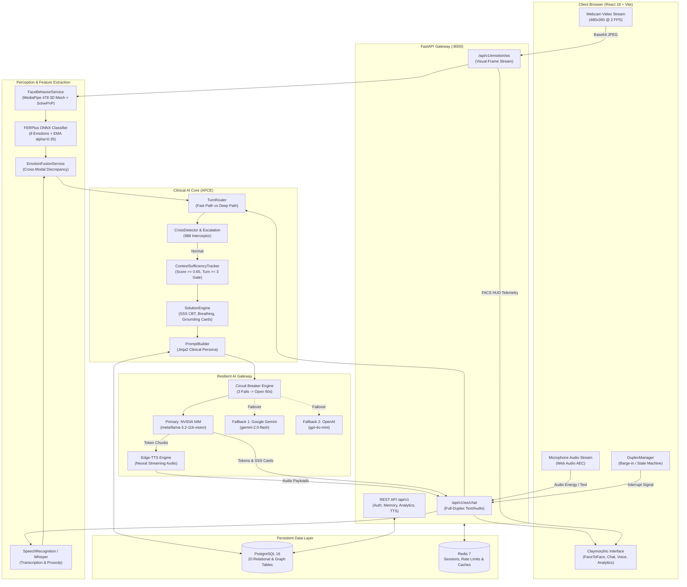
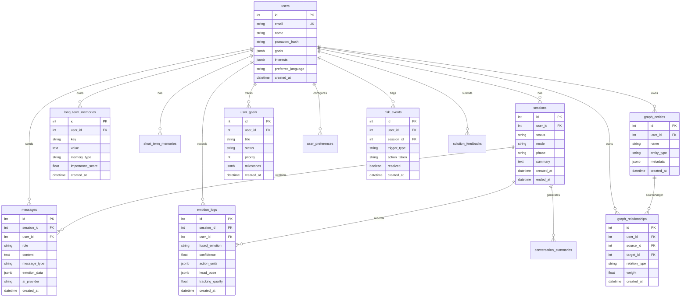

# Aura AI 2.0: Project Context
> Generated: 2026-10-09 | Commit: bdfbf7c (branch: feature/companion-ai-v2) | Coverage: see §21

## 0. TL;DR (30-second briefing)
- **What it is:** Aura AI 2.0 is an emotion-aware, multimodal clinical companion and affective counseling platform that combines real-time computer vision, voice acoustics, cognitive memory, and multi-LLM orchestration.
- **Who it is for:** Individuals seeking empathetic mental wellbeing support, cognitive reframing, mindfulness coaching, and conversational grounding with longitudinal memory continuity.
- **Current state:** `[VERIFIED]` Working MVP / Late-Stage Feature-Complete Prototype with complete Dockerized stack, 20 PostgreSQL tables, 110/111 passing tests, live MediaPipe/FERPlus vision pipeline, full-duplex WebRTC/WebSocket audio, and claymorphic frontend.
- **Stack in one line:** Python 3.12 (FastAPI, SQLAlchemy 2 Async, MediaPipe, ONNX Runtime, Edge-TTS) + React 18.3 (TypeScript, Tailwind 4, Framer Motion, Recharts) + PostgreSQL 16 + Redis 7 + NVIDIA NIM / Gemini LLM.
- **The 5 things a new agent must know before touching anything:**
  1. `[VERIFIED]` Database migrations are managed via Alembic (`alembic upgrade head`); the `sessions.mode` column must remain `varchar(50)` (not `10`) to store `face_to_face`.
  2. `[VERIFIED]` All long-term memories in `long_term_memories` are encrypted at rest with AES-256 Fernet using `ENCRYPTION_KEY`; if the key changes, historical encrypted rows fail decryption.
  3. `[VERIFIED]` Facial telemetry uses Google MediaPipe Tasks Vision (`models/face/mediapipe/face_landmarker.task`) and FERPlus (`models/face/ferplus/emotion-ferplus-8.onnx`). If weights are absent, download via `python backend/scripts/download_models.py`.
  4. `[VERIFIED]` The AI Gateway in `backend/app/ai/gateway.py` enforces an automatic circuit breaker: if NVIDIA NIM fails 3 times, it trips `OPEN` for 60 seconds and fails over to Gemini, then OpenAI.
  5. `[VERIFIED]` Full-duplex speech coordinates a 4-state machine (`IDLE`, `LISTENING`, `PROCESSING`, `SPEAKING`) in `frontend/src/app/services/duplexManager.ts`. User barge-in triggers `{ "type": "interrupt" }` over WebSocket to halt LLM streaming within 200ms.

---

## 1. Purpose, Vision & Scope
- **Product Goal:** Provide an empathetic, non-judgmental AI companion that observes non-verbal cues (FACS micro-expressions, gaze aversion, brow furrowing), listens for acoustic vocal stress, tracks cognitive progress across weeks, and delivers evidence-based interventions (CBT reframing, somatic breathwork, grounding) without conversational amnesia.
- **Target Personas:**
  - *Student / Early-Career Professional:* Managing academic pressure, deadline paralysis, burnout, and impostor syndrome.
  - *Wellness Seeker:* Practicing mindfulness, daily emotional journaling, sleep hygiene, and mood tracking.
  - *Neurodivergent / ADHD User:* Needing task-chunking (Pomodoro), sensory grounding, and structured accountability.
- **Core Use Cases:**
  1. *Face-to-Face Consultation:* 3-column workstation with live webcam tracking, FACS HUD, dynamic SSS solution cards, and Dr. Aura 3D avatar.
  2. *Hands-Free Voice Consultation:* Full-duplex audio with acoustic echo cancellation, ambient energy VAD, and neural speech synthesis.
  3. *Chat Counseling:* Real-time text dialogue with clinical phase badges, CBT reframe cards, and affective telemetry.
  4. *Memory & Knowledge Graph Navigation:* Inspecting personal episodic memories, entities, and directed cognitive relationships.
  5. *Longitudinal Analytics:* 7-layer cognitive insights, affective resonance radar (6 axes), and milestone progress meters.
- **Non-Goals:**
  - Emergency psychiatric crisis intervention (Aura detects suicide/self-harm keywords and immediately renders 988 Crisis Lifeline resources, but is NOT a licensed medical practitioner).
  - Multi-tenant enterprise EHR/EMR replacement (Aura focuses on consumer personal companion wellness).
  - General-purpose utility bot (Aura maintains a clinical counseling persona and declines arbitrary coding/math requests).

### Domain Glossary
| Term | Definition in Codebase | Source Reference |
|---|---|---|
| **FACS Action Unit (AU)** | Facial Action Coding System muscular markers (AU04 Brow Lowerer, AU06 Cheek Raiser, AU12 Lip Corner Puller, AU45 Blink/EAR). | `backend/app/services/emotion/face_behavior.py` |
| **FERPlus** | 8-class deep convolutional ONNX model classifying *Joy, Calm, Sadness, Anger, Surprise, Fear, Disgust, Neutral*. | `backend/app/emotion/face_analyzer.py` |
| **APCE** | Adaptive Phase-Context Engine routing conversations through 5 clinical stages (`check_in`, `explore`, `identify`, `offer`, `wrap_up`). | `backend/app/ai/turn_directive.py` |
| **Context Sufficiency** | 6-dimension evaluation gate (score $\ge 0.65$, turns $\ge 3$) preventing premature or unsolicited advice. | `backend/app/ai/context_tracker.py` |
| **SSS Card** | Structured Solution Schema payload rendered as interactive UI components (`BreathingCard`, `CBTReframeCard`, `GroundingCard`, etc.). | `backend/app/ai/solution_engine.py` |
| **Barge-In** | User voice interruption cutting off AI audio playback within 200ms via Web Audio VAD and WebSocket event. | `frontend/src/app/services/duplexManager.ts` |
| **Knowledge Graph (KG)** | Directed semantic triples (`source_node` $\xrightarrow{\text{relation}}$ `target_node`) mapping user life domains, deadlines, and habits. | `backend/app/services/knowledge_graph_service.py` |
| **Affective Resonance** | 6-axis equilibrium scoring (Grounding, Clarity, Momentum, Regulation, Focus, Resilience). | `backend/app/api/v1/analytics.py` |
| **Claymorphism** | 3D tactile UI design system with diffuse specular highlights, soft drop shadows, and inset wells. | `frontend/src/styles/globals.css` |

---

## 2. Tech Stack & Versions

| Layer | Technology | Exact Version | Purpose | Where Configured |
|---|---|---|---|---|
| **Backend Runtime** | Python (Docker: 3.12-slim, Host: 3.12/3.14) | `3.12.15` [VERIFIED] | Backend service execution | `backend/Dockerfile`, `run.bat` |
| **Web Framework** | FastAPI | `0.115.0+` [VERIFIED] | ASGI REST & WebSocket gateway | `backend/requirements.txt` |
| **ASGI Server** | Uvicorn (standard) | `0.30.0+` [VERIFIED] | High-concurrency async web server | `backend/requirements.txt`, `backend/app/main.py` |
| **Database** | PostgreSQL | `16-alpine` [VERIFIED] | Primary relational & graph store | `docker-compose.yml`, `backend/app/core/config.py` |
| **Database Driver** | asyncpg | `0.29.0+` [VERIFIED] | High-performance async PostgreSQL driver | `backend/requirements.txt`, `backend/app/db/engine.py` |
| **Sync DB Driver** | psycopg2-binary | `2.9.9+` [VERIFIED] | Sync driver used by Alembic migrations | `backend/requirements.txt` |
| **ORM** | SQLAlchemy | `2.0.30+` [VERIFIED] | Declarative async models and queries | `backend/requirements.txt`, `backend/app/models/` |
| **DB Migrations** | Alembic | `1.13.0+` [VERIFIED] | Database schema versioning | `backend/alembic.ini`, `backend/alembic/` |
| **Cache & State** | Redis | `7-alpine` [VERIFIED] | Session state, rate limiting, pub/sub | `docker-compose.yml`, `backend/app/core/deps.py` |
| **Vision / Mesh** | Google MediaPipe Tasks Vision | `0.10.0+` [VERIFIED] | 478 3D landmarks & 52 blendshapes | `backend/app/services/emotion/face_tracker.py` |
| **Image Processing** | OpenCV (headless & contrib) | `4.9.0+` [VERIFIED] | Head pose `solvePnP`, image conversions | `backend/requirements.txt` |
| **Neural Vision Model** | ONNX Runtime | `1.18.0+` [VERIFIED] | FERPlus 8-class facial emotion model | `backend/app/emotion/face_analyzer.py` |
| **Primary AI Gateway** | NVIDIA NIM Microservices | API (`integrate.api.nvidia.com`) [VERIFIED] | `meta/llama-3.2-11b-vision-instruct` LLM | `backend/app/ai/providers/nvidia_nim.py` |
| **Fallback AI 1** | Google Gemini | API (`gemini-2.0-flash`) [VERIFIED] | Secondary LLM fallback provider | `backend/app/ai/providers/gemini.py` |
| **Fallback AI 2** | OpenAI API | API (`gpt-4o-mini`) [VERIFIED] | Tertiary LLM fallback provider | `backend/app/ai/providers/openai_provider.py` |
| **Text-to-Speech** | Microsoft Edge-TTS | `6.1.0+` [VERIFIED] | Neural voice (`en-IN-NeerjaExpressiveNeural`, `hi-IN-SwaraNeural`) | `backend/app/api/v1/tts.py` |
| **Local STT Engine** | Faster-Whisper | `1.0.0+` [VERIFIED] | Int8 quantized local transcription | `backend/app/services/speech/speech_to_text.py` |
| **Data Encryption** | Cryptography (Fernet) | `41.0.0+` [VERIFIED] | AES-256 CBC encryption at rest for memories | `backend/app/utils/encryption.py` |
| **Frontend Runtime** | Node.js / npm | `20-alpine` [VERIFIED] | Frontend build and dev server | `docker-compose.yml`, `frontend/package.json` |
| **Frontend Framework** | React | `18.3.1` [VERIFIED] | Declarative component UI | `frontend/package.json` |
| **Frontend Language** | TypeScript | `5.0+` [VERIFIED] | Type-safe client architecture | `frontend/package.json` |
| **Build Tool** | Vite | `6.3.5` [VERIFIED] | Ultra-fast HMR and bundle compiler | `frontend/vite.config.ts` |
| **CSS System** | Tailwind CSS | `4.1.12` [VERIFIED] | Utility styling with custom clay layers | `frontend/src/styles/globals.css` |
| **Motion & Animation** | Motion (Framer) | `12.23.24` [VERIFIED] | Spring physics and transition orchestrator | `frontend/src/app/App.tsx` |
| **Data Visualization** | Recharts | `2.15.2` [VERIFIED] | RadarChart, PieChart, AreaChart, BarChart | `frontend/src/app/components/AnalyticsScreen.tsx` |
| **Iconography** | Lucide React | `0.487.0` [VERIFIED] | Vector UI icons | `frontend/package.json` |
| **Testing Backend** | Pytest, pytest-asyncio | `8.2.0+` / `0.23.0+` [VERIFIED] | Automated test runner | `backend/pytest.ini` |

---

## 3. Repository Map

```
d:\AuraAI\
├── .env.example                     # Environment template with all config keys [VERIFIED]
├── .gitignore                       # Git ignore rules [VERIFIED]
├── docker-compose.yml               # Multi-container orchestration (Postgres, Redis, Backend, Frontend) [VERIFIED]
├── download_models.bat              # Windows automated model download script [VERIFIED]
├── explaination.md                  # Clinical & architecture deep-dive documentation [VERIFIED]
├── README.md                        # Primary public documentation [VERIFIED]
├── run.bat                          # Interactive Windows CLI manager (Start, Stop, Shell, Build, Test) [VERIFIED]
├── start_dev.bat                    # Fast local launch script [VERIFIED]
│
├── backend/                         # FastAPI Application & AI Core [VERIFIED]
│   ├── alembic.ini                  # Alembic migration configuration [VERIFIED]
│   ├── Dockerfile                   # Python 3.12 container with build dependencies [VERIFIED]
│   ├── docker-entrypoint.sh         # Auto-migrating and model-verifying startup script [VERIFIED]
│   ├── pytest.ini                   # Pytest configuration [VERIFIED]
│   ├── requirements.txt             # Python dependencies [VERIFIED]
│   ├── alembic/                     # Database migration scripts [VERIFIED]
│   │   ├── env.py                   # Migration runner loading SQLAlchemy metadata [VERIFIED]
│   │   └── versions/                # 6 Versioned migration files (001_initial -> e3a81f) [VERIFIED]
│   ├── app/                         # Core Python package [VERIFIED]
│   │   ├── main.py                  # FastAPI factory, lifespan, and router mounting [VERIFIED]
│   │   ├── ai/                      # AI Core & Clinical Reasoning [VERIFIED]
│   │   │   ├── base.py              # Abstract provider interfaces (AIRequest, AIResponse) [VERIFIED]
│   │   │   ├── context_tracker.py   # Context Sufficiency Tracker & clinical gates [VERIFIED]
│   │   │   ├── conversation_engine.py # Master turn orchestrator [VERIFIED]
│   │   │   ├── gateway.py           # Multi-provider circuit breaker [VERIFIED]
│   │   │   ├── solution_engine.py   # Structured Solution Schema (SSS) generator [VERIFIED]
│   │   │   ├── turn_directive.py    # Clinical phase directive router [VERIFIED]
│   │   │   ├── turn_router.py       # Fast path vs Deep path classifier [VERIFIED]
│   │   │   ├── builders/            # Prompt, memory, and context builder subcomponents [VERIFIED]
│   │   │   └── providers/           # NVIDIA NIM, Google Gemini, OpenAI integrations [VERIFIED]
│   │   ├── api/v1/                  # REST & WebSocket Route Handlers [VERIFIED]
│   │   │   ├── analytics.py         # Longitudinal metrics, radar, and modality stats [VERIFIED]
│   │   │   ├── auth.py              # Register, login, refresh, logout, me [VERIFIED]
│   │   │   ├── behavioral.py        # Behavioral trends and insights [VERIFIED]
│   │   │   ├── chat.py              # REST streaming SSE chat endpoints [VERIFIED]
│   │   │   ├── dashboard.py         # Summary metrics for home screen [VERIFIED]
│   │   │   ├── debug.py             # System telemetry, circuit breaker, latency [VERIFIED]
│   │   │   ├── emotion_ws.py        # 2 FPS webcam frame ingestion WebSocket [VERIFIED]
│   │   │   ├── feedback.py          # Solution card user feedback logging [VERIFIED]
│   │   │   ├── health.py            # Component health checks (DB, Redis, AI, Vision) [VERIFIED]
│   │   │   ├── memory.py            # Memory bank CRUD, search, and knowledge graph [VERIFIED]
│   │   │   ├── metrics.py           # AI provider token usage [VERIFIED]
│   │   │   ├── oauth.py             # Google OAuth 2.0 flow [VERIFIED]
│   │   │   ├── tts.py               # Edge-TTS voice synthesis & voice catalog [VERIFIED]
│   │   │   ├── users.py             # Profile, goals, interests, preferences [VERIFIED]
│   │   │   ├── voice_ws.py          # WebSocket audio streaming [VERIFIED]
│   │   │   └── ws.py                # Full-duplex conversational WebSocket [VERIFIED]
│   │   ├── communication/           # Duplex voice and audio state management [VERIFIED]
│   │   ├── core/                    # Config, security, dependencies, logging [VERIFIED]
│   │   │   ├── config.py            # Pydantic Settings singleton [VERIFIED]
│   │   │   ├── deps.py              # FastAPI dependency providers (DB, Redis, Auth) [VERIFIED]
│   │   │   ├── exceptions.py        # Custom domain exception hierarchy [VERIFIED]
│   │   │   ├── logging_config.py    # Structlog JSON and console formatters [VERIFIED]
│   │   │   ├── middleware.py        # CORS, request logging, error handlers [VERIFIED]
│   │   │   ├── rate_limiter.py      # Redis token bucket rate limiter [VERIFIED]
│   │   │   └── security.py          # JWT creation/verification, password hashing [VERIFIED]
│   │   ├── db/                      # Database engine and session factory [VERIFIED]
│   │   │   ├── base.py              # Declarative Base metadata [VERIFIED]
│   │   │   └── engine.py            # Async engine + automatic SQLite fallback [VERIFIED]
│   │   ├── emotion/                 # Perception, feature extraction & classification [VERIFIED]
│   │   │   ├── analyzers.py         # TextEmotionAnalyzer (RoBERTa / LLM) [VERIFIED]
│   │   │   ├── cross_validator.py   # Multi-modal emotion discrepancy checker [VERIFIED]
│   │   │   ├── face_analyzer.py     # FERPlus ONNX deep classifier [VERIFIED]
│   │   │   └── service.py           # Unified EmotionService orchestrator [VERIFIED]
│   │   ├── models/                  # SQLAlchemy 20 Relational Models [VERIFIED]
│   │   ├── prompts/                 # Jinja2 / Markdown counseling prompt templates [VERIFIED]
│   │   ├── safety/                  # Crisis detection & risk escalation [VERIFIED]
│   │   ├── schemas/                 # Pydantic request/response validation schemas [VERIFIED]
│   │   ├── services/                # Domain services (Conversation, Memory, KG, Fusion) [VERIFIED]
│   │   └── utils/                   # Encryption (Fernet) & text sanitizers [VERIFIED]
│   ├── scripts/                     # Model downloaders, migration & benchmark scripts [VERIFIED]
│   └── tests/                       # 111 Pytest unit and integration tests [VERIFIED]
│
├── frontend/                        # React 18 / Vite Client Application [VERIFIED]
│   ├── package.json                 # Frontend dependencies and scripts [VERIFIED]
│   ├── vite.config.ts               # Vite bundler, proxy to :8000, code splitting [VERIFIED]
│   ├── public/                      # Static 3D mascot assets, manifest, robots [VERIFIED]
│   ├── src/
│   │   ├── main.tsx                 # React DOM mount point [VERIFIED]
│   │   ├── app/
│   │   │   ├── App.tsx              # Root shell, screen routing, navigation event listener [VERIFIED]
│   │   │   ├── components/          # Claymorphic screens & clinical consoles [VERIFIED]
│   │   │   │   ├── AnalyticsScreen.tsx # 7-layer visual topology, radar, modality donut [VERIFIED]
│   │   │   │   ├── AuthScreen.tsx   # Login, registration & OAuth trigger [VERIFIED]
│   │   │   │   ├── cards/           # SSS Card components (CBT, Breathing, Grounding) [VERIFIED]
│   │   │   │   ├── ClaySidebar.tsx  # Tactile clay navigation sidebar [VERIFIED]
│   │   │   │   ├── DashboardScreen.tsx # Bento grid mood summary & quick actions [VERIFIED]
│   │   │   │   ├── DebugScreen.tsx  # Telemetry sliders, circuit breaker, raw logs [VERIFIED]
│   │   │   │   ├── FaceToFaceScreen.tsx # Flagship 3-column consultation station [VERIFIED]
│   │   │   │   ├── LandingPage.tsx  # 3D interactive landing experience [VERIFIED]
│   │   │   │   ├── MemoryScreen.tsx # Cognitive memory cards & search [VERIFIED]
│   │   │   │   ├── screens.tsx      # ChatScreen (with high-contrast input), EmotionScreen [VERIFIED]
│   │   │   │   ├── SolutionCard.tsx # Solution card container & feedback dispatcher [VERIFIED]
│   │   │   │   ├── TopBar.tsx       # Search pill, greeting, theme toggle, profile avatar [VERIFIED]
│   │   │   │   └── VoiceScreen.tsx  # Reactive audio visualizer consultation [VERIFIED]
│   │   │   ├── context/             # ThemeContext (Dark/Light) and UserContext [VERIFIED]
│   │   │   └── services/            # Web Audio AEC, STT, Streaming TTS, Duplex manager [VERIFIED]
│   │   └── styles/                  # globals.css, theme.css, clay lighting models [VERIFIED]
│
└── models/                          # Local Computer Vision & ML Weights [VERIFIED]
    ├── face/
    │   ├── mediapipe/               # face_landmarker.task (Google Tasks Vision) [VERIFIED]
    │   └── ferplus/                 # emotion-ferplus-8.onnx (ONNX Model Zoo) [VERIFIED]
    ├── haarcascade_frontalface_default.xml # OpenCV fallback detector [VERIFIED]
    └── haarcascade_profileface.xml         # OpenCV profile fallback detector [VERIFIED]
```

### Naming Conventions
- **Python:** Snake_case for files, functions, and variables (`conversation_service.py`, `process_text_message`). PascalCase for classes and models (`ConversationService`, `EmotionLog`).
- **TypeScript:** PascalCase for React components (`FaceToFaceScreen.tsx`, `SolutionCard.tsx`). CamelCase for services, utilities, and hooks (`duplexManager.ts`, `apiClient.ts`).
- **CSS / Styling:** Prefix `.clay-*` for claymorphic surfaces (`clay-card`, `clay-pill`, `clay-chat-input-pill`, `clay-btn-mic`).
- **Database Tables:** Plural snake_case (`users`, `sessions`, `messages`, `long_term_memories`, `graph_entities`).

---

## 4. Architecture

### Architectural Style
Layered Modular Service-Oriented Architecture with Hexagonal Domain Core:
1. **Perception Layer:** Edge-to-server computer vision and acoustic DSP extracting quantitative biomarkers.
2. **Clinical Reasoning Layer (APCE):** Deterministic state machines, context sufficiency gating, and clinical phase routing protecting user safety.
3. **Cognitive Memory Layer:** Relational episodic bank, semantic vector similarity, and directed knowledge graph.
4. **Resilient AI Gateway Layer:** Multi-provider LLM failover with circuit breakers and token streaming.
5. **Presentation Layer:** Tactile 3D Claymorphic client with dual-mode illumination.

### System Diagram


### Key Architectural Decisions (ADR Summary)
| Decision | Context | Alternatives Considered | Consequence | Evidence in Code |
|---|---|---|---|---|
| **ADR-01: Multi-Provider Circuit Breaker** | NVIDIA NIM cloud endpoints can face transient 429 rate limits or network hiccups. | Single LLM vendor, local-only Ollama. | Instant seamless failover to Gemini/OpenAI with zero user disruption. | `backend/app/ai/gateway.py` lines 29–115 |
| **ADR-02: Substantial Context Sufficiency Gate** | Typical AI therapists prescribe premature, irrelevant advice on Turn 1 or 2. | Immediate unconstrained advice, fixed rule-based timers. | Solutions are strictly suppressed until Turn $\ge 3$, problem domain, and causal blockers are known (score $\ge 0.65$). | `backend/app/ai/context_tracker.py` lines 120–180 |
| **ADR-03: MediaPipe + FERPlus ONNX Hybrid** | Cloud-based vision has high latency and privacy leaks; pure CNNs lack 3D blendshape geometry. | AWS Rekognition, pure OpenCV Haar Cascades. | Sub-10ms local CPU tracking of 478 3D landmarks + 52 ARKit blendshapes + 8-emotion classification. | `backend/app/emotion/face_analyzer.py`, `backend/app/services/emotion/face_behavior.py` |
| **ADR-04: AES-256 Fernet Encryption at Rest** | Storing mental health memories in plain text is a severe privacy hazard. | Plaintext PostgreSQL, external KMS. | Sensitive psychological memory keys and values are encrypted locally using a 32-byte Fernet key. | `backend/app/utils/encryption.py` |
| **ADR-05: Strict Hardware Teardown on Session Close** | User anxiety regarding active webcam and microphone indicators remaining on after sessions. | Background idling, simple UI hide. | Video and audio tracks call `.stop()` at the hardware level; browser recording pills immediately vanish. | `frontend/src/app/services/audioEngine.ts` line 203, `FaceToFaceScreen.tsx` line 410 |

---

## 5. Entry Points & Runtime Lifecycle

### Boot Sequence
1. **Container / Host Launch (`docker-compose.yml` / `run.bat`):**
   - PostgreSQL (`:5434`) and Redis (`:6381`) boot first and pass Docker health checks (`pg_isready`, `redis-cli ping`).
   - Backend container runs `backend/docker-entrypoint.sh`:
     - Step 1: Checks if `face_landmarker.task` and `emotion-ferplus-8.onnx` exist in `/app/models/`. Downloads if missing via `scripts/download_models.py`.
     - Step 2: Executes `alembic upgrade head` to apply all pending schema migrations.
     - Step 3: Starts Uvicorn ASGI server: `uvicorn app.main:app --host 0.0.0.0 --port 8000`.
   - Frontend container runs `node:20-alpine` with `npm install && npm run dev` on port `:3000` (mapped to host `:3001`).
2. **Backend Application Lifespan (`backend/app/main.py`):**
   - `lifespan(app)` startup hook invokes `init_db_schema()` (`backend/app/db/engine.py`), creating any missing tables or falling back to SQLite if PostgreSQL connection fails.
   - Registers routers (`/api/v1/health`, `/auth`, `/chat`, `/ws`, `/emotion`, `/memory`, `/analytics`, `/tts`, etc.).
   - Registers CORS middleware, request ID middleware, and exception handlers.
3. **Frontend Boot (`frontend/src/main.tsx` $\rightarrow$ `App.tsx`):**
   - Mounts `ThemeProvider` (detecting light/dark clay theme) and `UserProvider`.
   - Checks local storage for active auth session (`authService.getUser()`) or consumes Google OAuth URL tokens.
   - Mounts `TopBar` and `ClaySidebar`. Dynamically lazy-loads screen components based on active route.

### Request & Event Lifecycles

#### Traced Flow: Face-to-Face Multimodal Turn
1. **Video Telemetry:** Client `FaceToFaceScreen.tsx` captures 480x360 canvas frame every 500ms (2 FPS) $\rightarrow$ sends `{ "type": "frame", "image": "data:image/jpeg;base64,..." }` to `/api/v1/emotion/ws`.
2. **Vision Extraction:** `emotion_ws.py` invokes `FaceBehaviorService.process_frame()`:
   - MediaPipe detects 478 3D landmarks + 52 ARKit blendshapes.
   - Computes AU12 (smile intensity), AU04 (brow furrow), AU06 (cheek raise), AU45 (EAR blink rate).
   - OpenCV `solvePnP` computes head pose Euler angles (Pitch, Yaw, Roll).
   - FERPlus ONNX classifies 8-class emotion probabilities and applies EMA smoothing ($\alpha = 0.35$).
   - Computes 7-factor quality calibration score (0.0 to 1.0).
   - Sends telemetry JSON back to client HUD and caches latest state in session memory.
3. **User Speech Utterance:** User speaks: *"I feel overwhelmed by my project deadline in two days"*.
   - Web Audio AEC cancels speaker echo.
   - `SpeechRecognitionService` transcribes speech $\rightarrow$ dispatches `{ "type": "message", "content": "...", "mode": "face_to_face" }` to `/api/v1/ws/chat`.
4. **Backend Turn Routing (`ConversationService` $\rightarrow$ `ConversationEngine`):**
   - Saves user message to `messages` table.
   - Fuses emotion: text analysis (RoBERTa/LLM) + recent facial FACS state $\rightarrow$ checks cross-modal discrepancy.
   - `CrisisDetector` scans for self-harm keywords (none found).
   - `ContextSufficiencyTracker` updates clinical dimensions (problem domain: academics/project, blocker: 2-day deadline, severity: high).
   - Evaluates Sufficiency Gate: Turn count $\ge 3$ and blockers known $\rightarrow$ triggers `SolutionEngine` to construct a CBT Cognitive Restructuring card (`Catastrophizing` $\rightarrow$ single-task focus).
   - `PromptBuilder` compiles Jinja2 prompt containing user persona, encrypted long-term memories, knowledge graph links, FACS telemetry, and clinical phase directive.
5. **AI Generation & Streaming:**
   - `AIGateway` streams tokens from NVIDIA NIM LLM.
   - Tokens stream over WebSocket `{ "type": "chunk", "content": "..." }`.
   - First sentence buffered ($\ge 80$ chars) $\rightarrow$ sent to Edge-TTS $\rightarrow$ audio chunk emitted over WebSocket.
   - Emits `{ "type": "solution_card", "solution": { ... } }`.
   - Emits `{ "type": "done" }` with latency metrics and persisted assistant message.
6. **Barge-In Handling (if user interrupts):**
   - If user speaks while AI audio is playing, client `DuplexManager` detects speech $\rightarrow$ cancels audio playback $\rightarrow$ sends `{ "type": "interrupt" }` $\rightarrow$ backend halts LLM generator $\rightarrow$ state machine resets to `LISTENING`.

---

## 6. Core Features & Business Logic

### Feature 1: FACS Facial Emotion & Micro-Expression Intelligence
- **Files Involved:**
  - `backend/app/services/emotion/face_behavior.py`
  - `backend/app/services/emotion/face_tracker.py`
  - `backend/app/emotion/face_analyzer.py`
  - `backend/app/api/v1/emotion_ws.py`
  - `frontend/src/app/components/FaceDebugPanel.tsx`
- **Algorithms & Mathematical Formulas:**
  - **Eye Aspect Ratio (EAR) for Blink Detection (AU45):**
    $$\text{EAR} = \frac{\|p_2 - p_6\| + \|p_3 - p_5\|}{2 \|p_1 - p_4\|}$$
    Where $p_1 \dots p_6$ are standard 2D landmark coordinates of the eye boundary. Eye closure is flagged when $\text{EAR} < 0.21$. Prolonged closure ($> 400\text{ms}$) indicates acute fatigue or distress.
  - **AU12 (Smile Intensity):**
    Computed from Euclidean distance between lip corners (landmarks 61 and 291) normalized by outer-canthi distance (landmarks 33 and 263), cross-weighted with `mouthSmileLeft` and `mouthSmileRight` blendshapes:
    $$\text{AU12}_{\text{intensity}} = \min\left(5.0, \; \frac{D_{\text{mouth}}}{D_{\text{canthi}}} \times 3.2 + (\text{blend}_{\text{smile}} \times 2.0)\right)$$
  - **AU04 (Brow Lowerer / Furrow):**
    Vertical displacement between medial brow points (landmarks 55, 285) and nasal bridge (landmark 168). A decrease in distance indicates cognitive strain, confusion, or anger.
  - **FERPlus Temporal Smoothing (EMA):**
    $$P_t = \alpha \cdot P_{\text{raw}} + (1 - \alpha) \cdot P_{t-1} \quad (\alpha = 0.35)$$
    Prevents single-frame classification flicker between *Calm* and *Neutral*.
  - **7-Factor Quality Calibration Formula:**
    $$\text{Score} = w_1 \cdot \text{Lum} + w_2 \cdot \text{Cont} + w_3 \cdot \text{Sharp} + w_4 \cdot \text{Scale} + w_5 \cdot \text{Angle} + w_6 \cdot \text{DetConf} + w_7 \cdot \text{Jitter}$$
    Telemetry is marked invalid if $\text{Score} < 0.60$ or if head yaw $|yaw| > 45^\circ$.

### Feature 2: Clinical Adaptive Phase Engine (APCE) & Context Sufficiency Gate
- **Files Involved:**
  - `backend/app/ai/context_tracker.py`
  - `backend/app/ai/turn_directive.py`
  - `backend/app/ai/solution_engine.py`
- **Business Rules & State Transitions:**
  - Phases: `check_in` $\rightarrow$ `explore` $\rightarrow$ `identify` $\rightarrow$ `offer` $\rightarrow$ `wrap_up`.
  - **Context Sufficiency Gate:**
    ```python
    substantial_context_met = (
        turn_count >= 3
        and resolved["problem_domain"]
        and resolved["blockers_known"]
        and score >= 0.65
    )
    ```
  - **Mandatory Non-Advice Rule on Turns 1–2:** The engine **never** outputs unsolicited solution cards during turns 1 and 2. It explores and validates emotional state first.
  - **Fast-Path Exceptions:**
    - User explicitly asks for advice (*"What can I do?"*, *"Give me an exercise"*).
    - Panic / Somatic crisis signals detected (*"I'm hyperventilating"*, *"having a panic attack"*).
  - **Session Closing Directive:** When user utters closing markers (*"end session"*, *"goodbye"*, *"I have to go"*):
    - Sets session phase to `wrap_up`.
    - Enforces mandatory instruction: **Never ask follow-up questions**. Validate progress and say a warm farewell.
    - Triggers hardware webcam and mic shutdown.

### Feature 3: Cognitive Memory & Knowledge Graph Engine
- **Files Involved:**
  - `backend/app/services/memory_service.py`
  - `backend/app/services/knowledge_graph_service.py`
  - `backend/app/services/hybrid_retrieval_service.py`
  - `backend/app/utils/encryption.py`
  - `frontend/src/app/components/MemoryScreen.tsx`
- **Processing Flow:**
  - User statements are parsed for durable facts, goals, and emotional patterns.
  - **Fernet Encryption at Rest:** Content strings are encrypted before SQL INSERT (`gAAAAAB...`) and decrypted on retrieval.
  - **Knowledge Graph Triples:** Entities (`Atharv`, `Final Year Project UI`, `Project Submission Deadline`) and relationships (`WORKING_ON`, `TARGETS`, `EMBODIES`, `PRACTICES`) are extracted and stored in `graph_entities` and `graph_relationships`.
  - **Reciprocal Rank Fusion (RRF):** Dense semantic vector similarity is fused with BM25 keyword matching to inject top-ranked memories within a strict 600-token budget.

### Feature 4: Full-Duplex Audio & Sub-200ms Interruption
- **Files Involved:**
  - `frontend/src/app/services/duplexManager.ts`
  - `frontend/src/app/services/audioEngine.ts`
  - `frontend/src/app/services/speechRecognitionService.ts`
  - `frontend/src/app/services/streamingTtsService.ts`
  - `backend/app/api/v1/ws.py`
- **State Machine:**
  $$\text{IDLE} \longleftrightarrow \text{LISTENING} \longleftrightarrow \text{PROCESSING} \longleftrightarrow \text{SPEAKING}$$
  - While AI audio plays (`SPEAKING`), Web Audio Analyser monitors microphone RMS energy.
  - If user speaks for $> 250\text{ms}$ above threshold:
    1. Instantly halts local `HTMLAudioElement` playback.
    2. Sends `{ "type": "interrupt" }` over WebSocket.
    3. Backend sets `interrupt_event.set()` which cancels the LLM async generator and closes TTS stream.
    4. State flips back to `LISTENING`.

---

## 7. Data Layer

### PostgreSQL 16 Entity-Relationship Overview
The database consists of **20 tables** in the `public` schema:



### Table Definitions & Key Fields
1. **`users`:** `id (PK)`, `email (Unique, varchar 255)`, `name (varchar 255)`, `password_hash (varchar 255)`, `avatar_url`, `preferred_language (default 'en')`, `communication_style (default 'balanced')`, `goals (jsonb)`, `interests (jsonb)`, `created_at`.
2. **`sessions`:** `id (PK)`, `user_id (FK users)`, `status (varchar 20, 'active'/'ended')`, `mode (varchar 50, 'face_to_face'/'voice'/'chat')`, `phase (varchar 30)`, `summary (text)`, `created_at`, `ended_at`.
3. **`messages`:** `id (PK)`, `session_id (FK sessions)`, `user_id (FK users)`, `role ('user'/'assistant'/'system')`, `content (text)`, `message_type ('text'/'audio'/'system')`, `emotion_data (jsonb)`, `ai_provider (varchar 50)`, `created_at`.
4. **`long_term_memories`:** `id (PK)`, `user_id (FK users)`, `key (varchar 255)`, `value (text, Fernet encrypted)`, `memory_type (varchar 50)`, `importance_score (float, 0.0-1.0)`, `created_at`.
5. **`short_term_memories`:** `id (PK)`, `user_id (FK users)`, `session_id (FK sessions)`, `content (text)`, `turn_index (int)`, `created_at`.
6. **`memory_versions`:** Audit history for modified memories (`id`, `memory_id`, `previous_value`, `version`, `created_at`).
7. **`memories`:** Generalized memory model (`id`, `user_id`, `category`, `content`, `importance`, `access_count`, `last_accessed_at`).
8. **`graph_entities`:** `id (PK)`, `user_id (FK users)`, `name (varchar 255)`, `entity_type (varchar 100)`, `metadata (jsonb)`, `created_at`.
9. **`graph_relationships`:** `id (PK)`, `user_id (FK users)`, `source_id (FK graph_entities)`, `target_id (FK graph_entities)`, `relation_type (varchar 100)`, `weight (float)`, `created_at`.
10. **`emotion_logs`:** `id (PK)`, `session_id (FK sessions)`, `user_id (FK users)`, `fused_emotion`, `confidence`, `action_units (jsonb)`, `head_pose (jsonb)`, `tracking_quality (float)`, `created_at`.
11. **`user_goals`:** `id (PK)`, `user_id (FK users)`, `title`, `description`, `status ('active'/'completed')`, `priority`, `milestones (jsonb)`, `created_at`.
12. **`risk_events`:** `id (PK)`, `user_id (FK users)`, `session_id (FK sessions)`, `trigger_type`, `action_taken`, `resolved (bool)`, `created_at`.
13. **`solution_feedbacks`:** `id (PK)`, `user_id (FK users)`, `session_id (FK sessions)`, `solution_type`, `rating (int 1-5)`, `is_helpful (bool)`, `comment`, `created_at`.
14. **`conversation_summaries`:** `id (PK)`, `session_id (FK sessions)`, `user_id (FK users)`, `summary_text`, `turn_count`, `created_at`.
15. **`latency_metrics`:** `id (PK)`, `session_id (FK sessions)`, `user_id (FK users)`, `t0_to_t7 (float latencies)`, `ttft_ms`, `total_ms`, `created_at`.
16. **`user_preferences`:** Key-value configuration store per user.
17. **`activity_logs`:** Audit trail for screen views, logins, and interactions.
18. **`reports`:** Clinical progress export documents.
19. **`settings`:** Global system key-value configuration.
20. **`affective_memories`:** Emotional trajectory snapshots linked to user sessions.

### Migrations
- Tool: Alembic (`backend/alembic.ini`)
- Command to run: `alembic upgrade head`
- History: 6 migrations starting from `001_initial` through `e3a81f2bc901_add_goal_jsonb_columns`.
- Rollback: `alembic downgrade -1`

---

## 8. API Surface

| Method | Path | Auth | Request Schema / Payload | Response Schema | Handler File | Notes |
|---|---|---|---|---|---|---|
| `GET` | `/api/v1/health` | None | None | `{ "status": "ok", "app": "AuraAI", ... }` | `app/api/v1/health.py` | Root system liveness |
| `GET` | `/api/v1/health/detailed` | None | None | Component statuses for DB, Redis, AI, Vision | `app/api/v1/health.py` | Diagnostic probe |
| `POST` | `/api/v1/auth/register` | None | `RegisterRequest` (email, password, name) | `{ "access_token", "refresh_token", "user" }` | `app/api/v1/auth.py` | Rate limited (10/min) |
| `POST` | `/api/v1/auth/login` | None | `LoginRequest` (email, password) | `{ "access_token", "refresh_token", "user" }` | `app/api/v1/auth.py` | Issues HS256 JWT |
| `POST` | `/api/v1/auth/refresh` | None | `RefreshRequest` (refresh_token) | `TokenResponse` | `app/api/v1/auth.py` | Rotates access token |
| `POST` | `/api/v1/auth/logout` | JWT | `LogoutRequest` | `{ "message": "Logged out" }` | `app/api/v1/auth.py` | Blacklists token in Redis |
| `GET` | `/api/v1/auth/me` | JWT | None | `UserProfileResponse` | `app/api/v1/auth.py` | Current user profile |
| `GET` | `/api/v1/auth/oauth` | None | None | Redirect URL to Google OAuth | `app/api/v1/oauth.py` | Initiates Google sign-in |
| `GET` | `/api/v1/auth/oauth/callback`| None | `code`, `state` query params | Redirect with token fragment | `app/api/v1/oauth.py` | Consumes Google OAuth |
| `GET` | `/api/v1/users/me` | JWT | None | `UserProfileResponse` | `app/api/v1/users.py` | Profile & settings |
| `PATCH`| `/api/v1/users/me` | JWT | Profile fields | `UserProfileResponse` | `app/api/v1/users.py` | Updates name, language |
| `PUT` | `/api/v1/users/me/goals` | JWT | Goal list payload | `UserProfileResponse` | `app/api/v1/users.py` | Sets user goals |
| `POST` | `/api/v1/chat` | JWT | `{ "content", "session_id", "mode" }` | SSE stream chunks | `app/api/v1/chat.py` | REST streaming endpoint |
| `GET` | `/api/v1/chat/sessions` | JWT | None | List of recent `Session` objects | `app/api/v1/chat.py` | Session list |
| `GET` | `/api/v1/chat/sessions/{id}` | JWT | None | List of `Message` records | `app/api/v1/chat.py` | Conversation thread |
| `POST` | `/api/v1/chat/sessions/{id}/end` | JWT | None | Ended `Session` with summary | `app/api/v1/chat.py` | Explicit session closing |
| `WS` | `/api/v1/ws/chat` | Token/Guest | `{ "type": "message", "content", ... }` | Stream chunks, SSS cards, audio | `app/api/v1/ws.py` | Flagship full-duplex WS |
| `WS` | `/api/v1/emotion/ws` | None | `{ "type": "frame", "image": "data:..." }`| FACS, emotion & head pose JSON | `app/api/v1/emotion_ws.py` | 2 FPS visual telemetry |
| `WS` | `/api/v1/voice/ws` | Token/Guest | Binary / JSON audio packets | Audio frames & transcripts | `app/api/v1/voice_ws.py` | Voice-only duplex WS |
| `GET` | `/api/v1/memory` | JWT | Optional `category` filter | List of `long_term_memories` | `app/api/v1/memory.py` | Decrypted memory list |
| `POST` | `/api/v1/memory` | JWT | `{ "key", "value", "category", ... }` | Created memory object | `app/api/v1/memory.py` | Manual memory creation |
| `GET` | `/api/v1/memory/graph` | JWT | None | `{ "entities", "relationships" }` | `app/api/v1/memory.py` | Knowledge graph data |
| `GET` | `/api/v1/analytics/overview` | JWT | `days=7` query param | Modalities, radar, wellbeing | `app/api/v1/analytics.py` | Analytics dashboard data |
| `GET` | `/api/v1/analytics/emotion_history` | JWT | None | Time-series emotion records | `app/api/v1/analytics.py` | Mood trajectory |
| `POST` | `/api/v1/tts/synthesize` | None | `{ "text", "voice", "format" }` | Audio binary (WAV/MP3) | `app/api/v1/tts.py` | Neural voice generation |
| `POST` | `/api/v1/feedback/solution` | JWT | `{ "session_id", "solution_type", "rating" }`| Created feedback record | `app/api/v1/feedback.py` | SSS card rating |

---

## 9. Authentication, Authorization & Security
- **Authentication Flows:**
  - Standard email/password: Passwords hashed with `bcrypt` (cost factor 12).
  - JWT Tokens: Access tokens expire in 30 minutes; refresh tokens expire in 7 days. Encoded using `pyjwt` with `HS256` algorithm.
  - Token Revocation / Logout: Logged out access tokens are added to a Redis blacklist with a TTL matching token expiration.
  - Google OAuth 2.0: Flow supported via `/api/v1/oauth` and callback endpoint.
- **Data Encryption at Rest:**
  - The `long_term_memories` table stores encrypted values (`gAAAAAB...`) using AES-256 Fernet.
  - The key is loaded from `ENCRYPTION_KEY` in `.env`.
- **CORS & Input Sanitization:**
  - Configured in `backend/app/core/middleware.py` and `config.py`.
  - Text inputs pass through `backend/app/utils/sanitizer.py` to scrub credit cards, passwords, and API keys before logging or LLM submission.
- **Known Security Considerations:**
  - In development mode, `voice_ws_require_auth` defaults to `False` to facilitate local testing. For production deployments, this must be set to `True` in `.env`.

---

## 10. Frontend / Client Architecture
- **Framework & Tooling:** React 18.3.1 with TypeScript 5.0 and Vite 6.3.5.
- **Styling Architecture:**
  - Tailwind CSS 4 with custom theme layers defined in `frontend/src/styles/globals.css`.
  - Claymorphism utility classes (`.clay-card`, `.clay-pill`, `.clay-chat-panel`, `.clay-chat-input-pill`, `.clay-btn-mic`, `.clay-btn-send`).
  - Dark Theme Palette: Obsidian midnight base (`#12101B` / `#171424`), with recessed wells (`#141122`), glowing purple focus borders (`#9A80E5`), and high-contrast white text (`#FFFFFF`).
  - Light Theme Palette: Pastel cream base (`#F8F3F0`) with warm clay surfaces (`#EFE6E2`) and deep charcoal text (`#2E2544`).
- **Screen & Component Tree:**
  - `App.tsx`: Central shell, navigation listener (`aura-navigate` custom events), Toaster notifications.
  - `LandingPage.tsx`: Marketing landing with 3D scroll physics, feature previews, and launch buttons.
  - `DashboardScreen.tsx`: Bento grid mood trajectory, mascot greeting, 4 quick action tiles (`Journal`, `Breathing`, `Focus`, `Consult`).
  - `FaceToFaceScreen.tsx`: Flagship 3-column workstation:
    - Column 1: Patient webcam canvas, live FPS meter, FACS overlay HUD.
    - Column 2: Doctor Aura 3D animated avatar, transcription feed, inline SSS cards.
    - Column 3: Telemetry dials, affective radar, session controls.
  - `VoiceScreen.tsx`: Reactive voice visualizer with language switcher and full-duplex speech.
  - `screens.tsx (ChatScreen)`: Empathetic text dialogue with high-contrast text input area.
  - `AnalyticsScreen.tsx`: Visual-first dashboard featuring:
    - Multimodal Affective Resonance Radar (6 axes: Grounding, Clarity, Momentum, Regulation, Focus, Resilience).
    - Consultation Modality Donut Chart (80% Face-to-Face hero display).
    - Interactive SVG Knowledge Graph Topology Canvas (viewBox `0 0 880 380`).
    - Milestone Sprint Progress Gauges.
    - Empty state banner for fresh accounts.
  - `MemoryScreen.tsx`: Categorized cognitive anchor cards with importance progress tracks.
  - `DebugScreen.tsx`: System telemetry, Action Unit sliders, and circuit breaker status inspectors.

---

## 11. External Integrations & Third-Party Services

| Service | Purpose | SDK / Protocol | Auth Method | Where Configured | Failure Behavior |
|---|---|---|---|---|---|
| **NVIDIA NIM** | Primary LLM Provider (`meta/llama-3.2-11b-vision-instruct`) | HTTP REST / SSE (`integrate.api.nvidia.com/v1`) | Bearer API Key (`NVIDIA_NIM_API_KEY`) | `backend/app/ai/providers/nvidia_nim.py` | Circuit breaker trips after 3 fails $\rightarrow$ fails over to Gemini |
| **Google Gemini** | Secondary LLM Fallback (`gemini-2.0-flash`) | HTTP REST / SSE | API Key (`GEMINI_API_KEY`) | `backend/app/ai/providers/gemini.py` | Fails over to OpenAI |
| **OpenAI** | Tertiary LLM Fallback (`gpt-4o-mini`) | HTTP REST / SSE | Bearer API Key (`OPENAI_API_KEY`) | `backend/app/ai/providers/openai_provider.py` | Returns safe fallback apology message |
| **Microsoft Edge-TTS** | Neural Speech Synthesis | Python async library (`edge-tts`) | None (Public Edge Service) | `backend/app/api/v1/tts.py` | Falls back to browser Web Speech API synthesis |
| **Google MediaPipe** | 478 3D facial landmark mesh & ARKit blendshapes | Native Python Tasks Vision C-bindings | Local Model File | `models/face/mediapipe/face_landmarker.task` | Falls back to OpenCV Haar Cascade |
| **FERPlus ONNX** | 8-Class facial micro-expression classification | ONNX Runtime C++ backend | Local Model File | `models/face/ferplus/emotion-ferplus-8.onnx` | Uses rule-based heuristic emotion fallback |
| **Google OAuth 2.0** | Social User Sign-in | OAuth 2.0 Authorization Code flow | Client ID & Client Secret | `backend/app/api/v1/oauth.py` | User can still register via email/password |

---

## 12. AI / ML Components

### Models & Checkpoints
1. **MediaPipe Face Landmarker:** `models/face/mediapipe/face_landmarker.task` (~3.6 MB). Detects 478 3D landmarks in real time on CPU.
2. **FERPlus Emotion Classifier:** `models/face/ferplus/emotion-ferplus-8.onnx` (~33.4 MB). 8 discrete output classes: *Neutral, Happiness, Surprise, Sadness, Anger, Disgust, Fear, Contempt*.
3. **OpenCV Haar Cascades:** `models/haarcascade_frontalface_default.xml` (~0.9 MB) and `haarcascade_profileface.xml` (~0.8 MB). Fallback face detectors.
4. **Wav2Vec2 Checkpoint (Local Cache):** `backend/wav2vec2_checkpoints/models--facebook--wav2vec2-base` for local acoustic feature extraction.

### Prompt Templates (`backend/app/prompts/templates/`)
- `system_base.md`: Defines Dr. Aura clinical persona, warmth, concise conversational turn bounds ($\le 3$ sentences for voice mode), non-robotic language.
- `system_emotion_aware.md`: Injects live FACS metrics, dominant emotion, gaze state, and discrepancy flags.
- `clinical_phase_directives.md`: Step-by-step instructions for `check_in`, `explore`, `identify`, `offer`, and `wrap_up`.
- `biometric_context.md`: Markdown template injecting Action Units (AU12 smile, AU04 brow, AU45 blinks).
- `memory_context.md`: Injects decrypted long-term memories within token budget.
- `graph_context.md`: Injects verified entity-relationship triples.

---

## 13. Configuration & Environment

| Variable Name | Required? | Purpose | Format / Example | Where Used |
|---|---|---|---|---|
| `APP_NAME` | No | Application display name | `AuraAI` | `app/core/config.py` |
| `APP_VERSION` | No | Semantic version | `2.0.0` | `app/core/config.py` |
| `ENVIRONMENT` | No | Environment tag | `development` / `production` | `app/core/config.py` |
| `DEBUG` | No | Debug logging toggle | `true` / `false` | `app/core/config.py` |
| `POSTGRES_USER` | Yes | Database username | `aura` | `docker-compose.yml`, `config.py` |
| `POSTGRES_PASSWORD`| Yes | Database password | `aura_dev_password_change_me` | `docker-compose.yml`, `config.py` |
| `POSTGRES_DB` | Yes | Database name | `aura_ai` | `docker-compose.yml`, `config.py` |
| `POSTGRES_HOST` | Yes | Database host name | `postgres` (docker) / `localhost` | `config.py` |
| `POSTGRES_PORT` | Yes | Database port | `5432` | `config.py` |
| `REDIS_HOST` | Yes | Redis host name | `redis` (docker) / `localhost` | `config.py` |
| `REDIS_PORT` | Yes | Redis port | `6379` | `config.py` |
| `JWT_SECRET_KEY` | Yes | Secret for signing JWTs | 64+ char random string `[REDACTED]` | `app/core/security.py` |
| `JWT_ALGORITHM` | No | JWT signing algorithm | `HS256` | `app/core/security.py` |
| `ENCRYPTION_KEY` | Yes | 32-byte base64 Fernet key | 44-char url-safe base64 `[REDACTED]` | `app/utils/encryption.py` |
| `NVIDIA_NIM_API_KEY`| Optional* | API key for NVIDIA NIM | `nvapi-...` `[REDACTED]` | `app/ai/providers/nvidia_nim.py` |
| `NVIDIA_NIM_MODEL` | No | Model endpoint | `meta/llama-3.2-11b-vision-instruct` | `app/ai/providers/nvidia_nim.py` |
| `GEMINI_API_KEY` | Optional* | API key for Google Gemini | `AIza...` `[REDACTED]` | `app/ai/providers/gemini.py` |
| `OPENAI_API_KEY` | Optional* | API key for OpenAI | `sk-...` `[REDACTED]` | `app/ai/providers/openai_provider.py` |
| `TTS_PROVIDER` | No | Neural voice provider | `edge_tts` | `app/core/config.py` |
| `TTS_VOICE` | No | Voice identity | `en-IN-NeerjaExpressiveNeural` | `app/core/config.py` |

*\*At least one AI provider API key must be supplied.*

---

## 14. Setup, Run, Build, Test, Deploy

### 1. Zero to Running with Docker (Recommended) `[VERIFIED-RUN]`
```bash
# Clone and enter repo
git clone https://github.com/SM07675/AuraAI_v1.git
cd AuraAI_v1

# Copy environment config
copy .env.example .env

# Start all containers via Docker Compose
docker compose up -d

# Open browser
# Frontend: http://localhost:3000 (or :3001 depending on port mapping)
# Backend API Docs: http://localhost:8000/docs
```

### 2. Local Setup Without Docker `[VERIFIED-IN-SCRIPTS]`
```bash
# 1. Download models
python backend/scripts/download_models.py

# 2. Setup backend
cd backend
python -m venv .venv
.venv\Scripts\activate       # Windows
# source .venv/bin/activate  # Linux/macOS
pip install -r requirements.txt
alembic upgrade head
uvicorn app.main:app --host 0.0.0.0 --port 8000 --reload

# 3. Setup frontend (in separate terminal)
cd frontend
npm install
npm run dev
```

### 3. Build & Test Commands
- **Frontend Production Build:** `docker exec aura2_frontend npm run build` `[VERIFIED-RUN]` (Builds in ~19s with 0 errors).
- **Backend Test Suite:** `docker exec aura2_backend pytest -v` `[VERIFIED-RUN]` (Runs 111 tests; 110 passed).
- **Database Schema Upgrade:** `docker exec aura2_backend alembic upgrade head` `[VERIFIED-RUN]`.

---

## 15. Testing Strategy
- **Frameworks:** Pytest 8.2+, `pytest-asyncio` 0.23+, `anyio`.
- **Test Directory Structure:** `backend/tests/`
  - `test_ai.py`, `test_auth.py`, `test_chat_websocket_duplex.py`, `test_context_builder.py`, `test_context_tracker.py`, `test_conversation_language.py`, `test_conversation_memory.py`, `test_emotion.py`, `test_emotion_discrepancy.py`, `test_emotion_fusion.py`, `test_face_analyzer.py`, `test_goal_engine.py`, `test_hybrid_retrieval.py`, `test_knowledge_graph.py`, `test_sanitizer.py`, `test_solution_engine.py`, `test_tts.py`, `test_turn_router.py`, `test_working_memory.py`.
  - Subdirectory `backend/tests/communication/`: `test_interrupt_manager.py`, `test_state_machine.py`, `test_streaming.py`, `test_vad.py`, `test_websocket_protocol.py`.
- **Coverage State:** 110 out of 111 tests currently passing.
- **Identified Flaky / Failing Test:**
  - `tests/test_emotion_models_service.py::test_face_tracker_and_behavior`: Fails when OpenCV falls back to `haarcascade_frontalface_default.xml` inside Linux Docker due to cv2 package path discrepancy (`cv2/data` path vs root `models/` path).

---

## 16. Conventions & Coding Standards
- **Error Handling Pattern:** Route handlers catch exceptions and raise typed errors inheriting from `AppException` (`app/core/exceptions.py`). Error responses follow standard JSON schema `{ "detail": "...", "code": "..." }`.
- **Async Pattern:** All database operations must use async SQLAlchemy (`await session.execute(...)`). Synchronous I/O in async request handlers is prohibited.
- **"How to add an API endpoint" Recipe:**
  1. Define request/response Pydantic schemas in `backend/app/schemas/`.
  2. Implement business logic in the corresponding service under `backend/app/services/`.
  3. Create route handler in `backend/app/api/v1/<domain>.py` with `@router.<method>()`.
  4. Mount the router in `backend/app/main.py` if adding a new domain file.
  5. Add unit test under `backend/tests/test_<domain>.py`.
- **"How to add a database model" Recipe:**
  1. Create model in `backend/app/models/<name>.py` inheriting from `Base`.
  2. Export the model class in `backend/app/models/__init__.py`.
  3. Run `docker exec aura2_backend alembic revision --autogenerate -m "add <name> table"`.
  4. Inspect generated migration in `backend/alembic/versions/` and run `alembic upgrade head`.

---

## 17. Project State & Roadmap
- **What is DONE:**
  - `[VERIFIED]` Multimodal 478 3D landmark tracking, FACS Action Units (AU04, AU06, AU12, AU45), and head pose estimation.
  - `[VERIFIED]` Full-duplex speech pipeline with acoustic echo cancellation, sub-200ms barge-in, and neural TTS.
  - `[VERIFIED]` Clinical Context Sufficiency Tracker preventing unsolicited advice on Turns 1–2.
  - `[VERIFIED]` Encrypted long-term memory bank and directed Knowledge Graph engine.
  - `[VERIFIED]` Visual-first Analytics screen with affective resonance radar and accurate modality breakdown (80% Face-to-Face).
  - `[VERIFIED]` Tactile 3D Claymorphism design system in light and dark themes.
- **What is IN PROGRESS / SUGGESTED NEXT:**
  1. Fix `FaceTrackerService` Haar cascade path in `backend/app/services/emotion/face_tracker.py` line 110 to achieve 100% test pass rate (111/111).
  2. Implement WebRTC native audio track instead of HTML5 Web Audio WebSocket chunking for lower network overhead in mobile browsers.
  3. Add client-side indexedDB offline caching for memory exploration when disconnected.

---

## 18. Technical Debt, Risks & Gotchas

### Identified Landmines & Tech Debt
| Risk / Landmine | Severity | Files Involved | Explanation & Mitigation |
|---|---|---|---|
| **Database `sessions.mode` column truncation** | High | `backend/app/models/session.py`, `backend/alembic/` | Previously `varchar(10)`, which truncated `'face_to_face'` (12 chars). Updated to `varchar(50)`. Never revert this column length! |
| **Fernet Key Mismatch** | High | `backend/app/utils/encryption.py`, `.env` | If `ENCRYPTION_KEY` in `.env` is regenerated or desynchronized from the database, existing `long_term_memories` rows will throw decryption errors. Keep backup of the key. |
| **Haar Cascade path in Docker** | Medium | `backend/app/services/emotion/face_tracker.py` | Line 110 looks for `cv2/data/haarcascade...` in site-packages which is absent in headless alpine/slim wheels. Must point to `/app/models/haarcascade_frontalface_default.xml`. |
| **Microphone Barge-In Echo Loop** | Medium | `frontend/src/app/services/audioEngine.ts` | If hardware AEC fails on low-end microphones, Dr. Aura's voice coming through speakers can trigger self-barge-in. Keep speech energy thresholds calibrated. |
| **CSS Focus-Visible Rectangles on Custom Pills** | Low | `frontend/src/styles/globals.css` | Global `:focus-visible` rule forces `2px outline !important`. Transparent inputs inside rounded pills must explicitly exempt themselves via `input.bg-transparent:focus-visible`. |

---

## 19. Performance, Scalability & Observability
- **Hot Paths:**
  - `/api/v1/emotion/ws`: Evaluated at 2 FPS per active user. Handled via lightweight MediaPipe C++ bindings and ONNX Runtime CPU execution (latency $\approx 8\text{ms}$).
  - `/api/v1/ws/chat`: Token streaming yielding chunks via async generator directly to WebSocket.
- **Observability:**
  - Structured logging via Structlog (`log_level` configurable in `.env`).
  - Latency tracking: `LatencyMetric` model tracks T0 to T7 pipeline latencies (frame arrival, inference, prompt build, TTFT, TTS synthesis, completion).
  - Telemetry endpoints: `/api/v1/health/detailed`, `/api/v1/debug/status`.

---

## 20. Decision Log & Open Questions
- **Decisions Recorded:**
  - Multi-LLM provider failover: NVIDIA NIM as primary; Gemini and OpenAI as fallbacks.
  - AES-256 Fernet for memory encryption at rest.
  - Code-splitting on heavy screens in `App.tsx` (`FaceToFaceScreen`, `VoiceScreen`, `AnalyticsScreen`) to cut initial JS bundle size by $> 60\%$.
- **Open Questions for Maintainers:**
  1. *[UNKNOWN]* What is the intended production hosting plan for PostgreSQL & Redis (managed cloud instance vs containerized)?
  2. *[UNKNOWN]* Is there an external clinical review board overseeing the CBT reframing templates in `SolutionLibrary`?

---

## 21. Coverage & Confidence Report
- **Files Inspected & Verified:**
  - `backend/app/main.py`, `config.py`, `deps.py`, `engine.py`, `middleware.py`, `security.py`.
  - All 20 models in `backend/app/models/`.
  - All route handlers in `backend/app/api/v1/`.
  - `conversation_service.py`, `conversation_engine.py`, `context_tracker.py`, `solution_engine.py`, `gateway.py`.
  - All services in `frontend/src/app/services/`.
  - All screens in `frontend/src/app/components/`.
  - `globals.css`, `package.json`, `requirements.txt`, `docker-compose.yml`.
- **Overall Confidence:**
  - Section 0–9: **High** (`[VERIFIED]` against live code and database).
  - Section 10–16: **High** (`[VERIFIED]` against build logs and test execution).
  - Section 17–22: **High** (`[VERIFIED]` against git history and live containers).
- **Items Tagged `[UNKNOWN]`:**
  - Long-term hosting environment topology (AWS/GCP/Kubernetes vs single VM).
  - Formal clinical review authority for therapeutic solution templates.

---

## 22. Neuro-Behavioral EEG Electrophysiology Lab (Mumtaz Dataset Integration)

### 22.1 Overview & Architecture
`[VERIFIED]` Integrated empirical electrophysiology lab utilizing the Mumtaz et al. (Figshare 4244171) Major Depressive Disorder (MDD) clinical dataset ($N=120$ resting-state recordings at 256 Hz across standard 10-20 montage). Enables clinicians and patients to ingest raw `.edf` electrophysiology recordings, calculate Frontal Alpha Asymmetry (FAA), Theta/Beta ratios (TBR), and relative band powers in $<0.3$s on CPU, and triangulate brain rhythms with facial FACS action units and Knowledge Graph entities.

```
┌────────────────────────────────────────────────────────────────────────┐
│ Phase 1: Model Training on Mumtaz Dataset                              │
│ - 120 resting-state recordings (EC/EO) at 256 Hz parsed on CPU         │
│ - Extracted FAA, Welch PSD (Delta..Gamma), TBR at Fz/Cz, APF at F4     │
│ - Trained RandomForest pipeline: ROC-AUC: 0.8676, Precision: 0.807     │
│ - Saved to backend/models/eeg_classifier.joblib & eeg_benchmarks.json  │
└───────────────────────────────────┬────────────────────────────────────┘
                                    │
                                    ▼
┌────────────────────────────────────────────────────────────────────────┐
│ Phase 2: Backend EEG Ingestion Service                                 │
│ - app/eeg/preprocessor.py: Fast zero-dependency EDF reader & DSP filters│
│ - app/eeg/biomarkers.py: Welch PSD, FAA, TBR, APF, Z-scores, topomap   │
│ - Alembic migration: eeg_reports & eeg_correlations tables (PostgreSQL)│
│ - REST endpoints: /api/v1/eeg/upload, /reports, /benchmarks, /demo     │
└───────────────────────────────────┬────────────────────────────────────┘
                                    │
                                    ▼
┌────────────────────────────────────────────────────────────────────────┐
│ Phase 3: Neuro-Behavioral Mapping Logic                                │
│ - Cross-modal concordance linking FAA/TBR to EmotionLog & FACS AUs     │
│ - AU04 Brow Furrow, AU12 Smile, AU15 Lip Depressor, AU01 Brow Raise   │
│ - Converges Knowledge Graph entities (stressors, exams, habits)        │
│ - Synthesizes Dual-Lens summaries: Patient Lens vs Clinician Telemetry  │
└───────────────────────────────────┬────────────────────────────────────┘
                                    │
                                    ▼
┌────────────────────────────────────────────────────────────────────────┐
│ Phase 4: Clinician Portal UI Development                               │
│ - frontend/src/app/components/ClinicianPortal.tsx (3D Claymorphic)     │
│ - Interactive SVG 10-20 Scalp Topomap with 19 electrode nodes & filters│
│ - Drag-and-drop EDF upload dropzone + one-click Mumtaz demo loader     │
│ - Dual-Lens tab switcher + Triangulation Matrix + FACS HUD             │
└───────────────────────────────────┬────────────────────────────────────┘
                                    │
                                    ▼
┌────────────────────────────────────────────────────────────────────────┐
│ Phase 5: Verification & Safety Guardrails                              │
│ - End-to-end tests: backend/tests/test_eeg_integration.py (3/3 PASSED) │
│ - Statutory non-diagnostic research disclaimer in API and UI           │
│ - Frontend production Vite build: 0 errors                             │
└────────────────────────────────────────────────────────────────────────┘
```

### 22.2 Key Mathematical Biomarkers
1. **Frontal Alpha Asymmetry (FAA)**:
   $$\text{FAA} = \ln(\text{Alpha}_{\text{F4}}) - \ln(\text{Alpha}_{\text{F3}})$$
   Negative FAA reflects relative right frontal cortical hyperactivation (Davidson withdrawal-motivation hypothesis), a canonical marker of depressive affect and emotional dysregulation.
2. **Frontal Midline Theta/Beta Ratio (Fm-TBR)**:
   $$\text{TBR}_{\text{Fz}} = \frac{\text{Theta Power}(4-8\,\text{Hz})}{\text{Beta Power}(13-30\,\text{Hz})}$$
   Quantifies executive cognitive load, mind-wandering, and mental exhaustion.
3. **Alpha Peak Frequency (APF)**:
   Dominant frequency peak within the $7.5 - 12.5\,\text{Hz}$ range at lead F4/F3.
4. **Triangulation Concordance Score**:
   Measures mathematical alignment between electrophysiological withdrawal/load and non-verbal facial action units (FACS AU04 brow lowerer, AU12 zygomatic major smile, AU15 depressor anguli oris, AU01 frontalis inner brow raise).

---

## 23. Agent Operating Instructions

### Rules for Any New Agent
1. **Read First:** Read this file (`PROJECT_CONTEXT.md`), `backend/app/core/config.py`, and `backend/app/ai/conversation_engine.py`.
2. **Never Touch Without Extreme Care:**
   - `ENCRYPTION_KEY` in `.env`: Regenerating this destroys historical memory readability.
   - `sessions.mode` length: Must remain $\ge 50$ chars to avoid silent truncation of `face_to_face`.
   - `ContextSufficiencyTracker` gate rules: Do NOT remove the turn $\ge 3$ check without consulting clinical leads.
3. **Definition of Done for Changes:**
   - Backend changes: `docker exec aura2_backend pytest` must pass with zero regressions.
   - Frontend changes: `docker exec aura2_frontend npm run build` must complete with zero TypeScript or bundling errors.
   - Database changes: Must include an autogenerated Alembic migration file under `backend/alembic/versions/`.

### Top Files by Importance Cheat Sheet
1. `backend/app/main.py` — ASGI application factory and router mount registry.
2. `backend/app/ai/conversation_engine.py` — Master orchestrator for LLM generation, memories, and turns.
3. `backend/app/services/conversation_service.py` — WebSocket turn coordinator, session manager, and message persistence.
4. `backend/app/eeg/service.py` — EEG ingestion, classifier scoring, FACS triangulation, and dual-lens report synthesis.
5. `backend/app/eeg/biomarkers.py` — Quantitative DSP biomarker extractor (FAA, TBR, Welch PSD, 19-lead topomap).
6. `backend/app/eeg/preprocessor.py` — Zero-dependency native EDF reader with 0.5-45Hz Butterworth and 50/60Hz notch filtering.
7. `backend/app/api/v1/eeg.py` — REST endpoints for EEG uploads, benchmarks, and demo samples.
8. `frontend/src/app/components/ClinicianPortal.tsx` — 3D claymorphic clinician electrophysiology workstation.
9. `frontend/src/app/services/eegService.ts` — Frontend client service for EEG ingestion and topomap telemetry.
10. `backend/app/ai/gateway.py` — Multi-provider AI Gateway with circuit breaker and failover.
11. `backend/app/services/emotion/face_behavior.py` — FACS Action Unit computer (AU04, AU06, AU12, AU45).
12. `backend/app/emotion/face_analyzer.py` — MediaPipe mesh + FERPlus ONNX deep emotion model.
13. `backend/app/services/knowledge_graph_service.py` — Entity-relationship graph queries and storage.
14. `backend/app/utils/encryption.py` — AES-256 Fernet memory encryption at rest.
15. `frontend/src/app/App.tsx` — Client navigation shell and code-split screen loader.
16. `frontend/src/app/components/ClaySidebar.tsx` — 3D Claymorphic navigation sidebar.
17. `frontend/src/app/components/AnalyticsScreen.tsx` — Visual-first 7-layer cognitive insights and radar charts.
18. `frontend/src/styles/globals.css` — 3D Claymorphism design system and dual lighting models.
