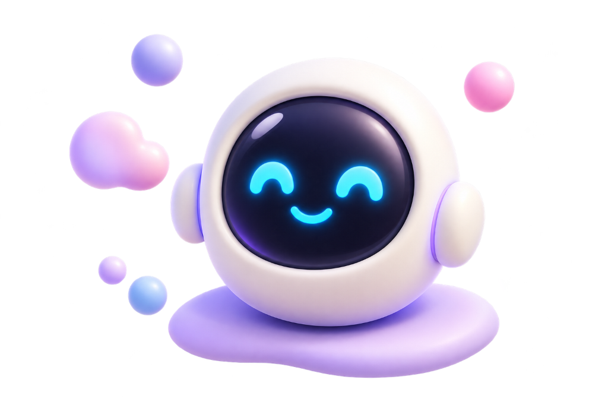

# 🌸 Aura AI 2.0 — Emotion-Aware Multimodal AI Companion & Cognitive Platform

<div align="center">



**A production-grade, multimodal conversational AI platform featuring real-time FACS Action Unit tracking, 478 3D facial landmarks, FERPlus emotion recognition, cognitive knowledge graphs, long-term memory, and a tactile 3D claymorphic interface.**

[](https://www.python.org/)
[](https://fastapi.tiangolo.com/)
[](https://react.dev/)
[](https://www.typescriptlang.org/)
[](https://developers.google.com/mediapipe)
[](https://onnxruntime.ai/)
[](https://build.nvidia.com/)
[](https://www.postgresql.org/)
[](https://redis.io/)
[](https://www.docker.com/)

[Key Features](#-key-features) • [Facial Pipeline](#-facial-behavior--emotion-pipeline) • [Architecture](#-system-architecture) • [Getting Started](#-getting-started-step-by-step) • [Model Setup](#-automated-model-setup) • [API & WebSockets](#-api--websocket-reference) • [Configuration](#-environment-variables) • [Troubleshooting](#-troubleshooting--faq)

</div>

---

## 🌟 Overview

**Aura AI 2.0** is an emotion-aware multimodal platform that listens, observes, remembers, and responds empathetically. By combining live computer vision, speech acoustics, cognitive knowledge graphs, and large language models (NVIDIA NIM / Gemini / OpenAI), Aura detects micro-expressions and shifts in user emotion to provide personalized wellbeing support, coaching, and natural companionship.

---

## ✨ Key Features

### 👁️ 1. Advanced Facial Behavior & Emotion Intelligence
- **478 3D Facial Landmarks & 52 ARKit Blendshapes**: High-density facial mesh tracking via Google MediaPipe Tasks vision pipeline running at sub-10ms CPU inference.
- **FACS Action Units (Facial Action Coding System)**:
  - **AU12 (Lip Corner Puller / Smile)**: Accurate smile intensity scoring (0–100% and 0–5 scale).
  - **AU04 (Brow Lowerer / Furrow)**: Real-time brow contraction monitoring for confusion, concentration, or distress.
  - **AU06 (Cheek Raiser / Duchenne Marker)**: Distinguishes genuine Duchenne smiles from polite smiles.
  - **AU45 (Blink Rate & EAR)**: Eye Aspect Ratio tracking for blink rate (BPM), drowsiness, and fatigue.
  - **AU01 & AU26 (Inner Brow Raise & Jaw Drop)**: Surprise and vocalization markers.
- **3D Head Pose Estimation**: Computes accurate `pitch`, `yaw`, and `roll` Euler angles using OpenCV Perspective-n-Point (`SolvePnP`) against anatomical 3D facial landmarks.
- **Gaze & Eye-Contact Tracking**: Pupil-to-canthi vector analysis that classifies user attention state (**Attentive** vs **Averted**).
- **FERPlus Deep Emotion Classification**: ONNX Runtime deep network classifying 8 core emotions (*Joy, Calm, Sadness, Anger, Surprise, Fear, Disgust, Neutral*) with exponential moving average (EMA) temporal smoothing.
- **7-Factor Quality Calibration**: Validates ambient luminance, contrast, blur/sharpness, face scale, head angle, det-confidence, and jitter before inferring state.

### 🧠 2. Cognitive Memory & Knowledge Graph
- **Episodic & Long-Term Memory**: Stores and categorizes user goals, personal history, relationships, and wellbeing milestones.
- **Knowledge Graph (Entity-Relationship Engine)**: Auto-extracts entities, relationships, and concept nodes into PostgreSQL graph tables for high-order reasoning.
- **Hybrid Retrieval**: Combines semantic embeddings, dense vector search, and keyword BM25 retrieval for zero-latency prompt injection.
- **Working Memory Window**: Tracks turn-by-turn conversational state, topic drift, and sentiment shifts.

### 💬 3. Resilient Multimodal AI Gateway
- **NVIDIA NIM Microservice Support**: Pre-configured for high-throughput streaming models (e.g., `meta/llama-3.2-11b-vision-instruct`, `nvidia/llama-3.1-nemotron-70b-instruct`).
- **Autonomous Circuit Breaker**: Auto-trips when providers fail and fails over seamlessly through configured priority (`nvidia_nim` → `gemini` → `openai`).
- **SSE Token Streaming**: Fluid word-by-word streaming generation directly connected to speech synthesizers.
- **Dynamic Prompt Engine**: Injects real-time Action Units, gaze states, emotion duration, and memory entities directly into the counselor persona.

### 🎨 4. Tactile 3D Claymorphic Interface
- **Tactile Clay Design**: Soft 3D extruded surfaces, diffuse specular highlights, dynamic shadows, and 3D icons.
- **Dual Aesthetic Theme System**:
  - **Pastel Cream Light Mode**: Calming, soft-clay warm palette.
  - **Obsidian Midnight Dark Mode**: Deep violet-charcoal `#12101B` / `#171424` aesthetic.
- **Bento Experience Consoles**:
  - 🏠 **Dashboard**: 7-day mood trajectories, mascot check-in, wellbeing donut graphs, and quick actions.
  - 💬 **Chat Mode**: Empathetic conversational console with real-time reasoning and memory tags.
  - 🎙️ **Voice Mode**: Interactive voice agent with reactive audio visualizer and continuous STT/TTS.
  - 📹 **Face-to-Face Consultation**: 3-column command center with camera stream, live FACS telemetry dials, AI avatar, and memory HUD.
  - 🧠 **Memory Screen**: Filterable knowledge cards with priority levels, categories, and confidence meters.
  - 📊 **Analytics Console**: Weekly wellbeing charts, calm streaks, and emotion distributions powered by Recharts.
  - 🛠️ **Debug Telemetry Panel**: Live system latency, Action Unit sliders, circuit breaker statuses, and raw JSON inspectors.

---

## 🔬 Facial Behavior & Emotion Pipeline

```
  Camera Feed (Canvas 480x360 @ 2 FPS)
                   │
                   ▼
┌────────────────────────────────────────────────────────┐
│  Face Detection & 478 3D Mesh Alignment (MediaPipe)    │
│  - 478 3D Landmarks (X, Y, Z)                          │
│  - 52 ARKit Blendshapes                                │
└────────────────────────────────────────────────────────┘
                   │
         ┌─────────┴────────────────────────┐
         ▼                                  ▼
┌─────────────────────────┐      ┌─────────────────────────┐
│   Behavior Service      │      │  FERPlus ONNX Classifier│
│ - AU12, AU04, AU06, AU45│      │ - 8-Class Emotion Prob  │
│ - Head Pose (SolvePnP)  │      │ - EMA Temporal Smoothing│
│ - Gaze / Eye-Contact    │      │ - Dynamic Calibration   │
└─────────────────────────┘      └─────────────────────────┘
         │                                  │
         └─────────────────┬────────────────┘
                           ▼
┌────────────────────────────────────────────────────────┐
│     Multimodal Emotion Fusion & Quality Scoring        │
│     - Tracking Quality (7-Factor Score 0.0 - 1.0)      │
│     - Emotion Stability & Transition State Engine      │
└────────────────────────────────────────────────────────┘
                           │
                           ▼
┌────────────────────────────────────────────────────────┐
│     Context & Prompt Engine ──► NVIDIA NIM LLM        │
│     - Injects: dominant emotion, AU intensity, gaze    │
│     - Streams empathetic response back via WebSocket   │
└────────────────────────────────────────────────────────┘
```

---

## 🏛 System Architecture

```mermaid
flowchart TB
    subgraph Client ["Client Browser (React 18 + Vite)"]
        UI[Claymorphic Bento UI]
        Cam[Webcam & Audio Processor]
        UI <--> Cam
    end

    subgraph API_Layer ["FastAPI Gateway (:8000)"]
        HTTP[REST Endpoints /api/v1]
        WS_Chat["Chat WebSocket (/api/v1/ws/chat)"]
        WS_Emo["Emotion WebSocket (/api/v1/emotion/ws)"]
    end

    subgraph Core_Services ["AI Core & Services"]
        FaceEngine[FaceBehaviorService & FERPlus]
        TurnRouter[Turn Router & Context Ranker]
        PromptEng[Prompt & Personality Engine]
        AIGateway[AI Provider Gateway]
        TTS[Edge-TTS Neural Voice]
    end

    subgraph Memory_Layer ["Cognitive Knowledge & Storage"]
        KG[Knowledge Graph Service]
        MemSvc[Semantic Memory Service]
        PG[(PostgreSQL 16 - Graph & Relational)]
        Redis[(Redis 7 - Session & Cache)]
    end

    Cam -->|Frame (Base64)| WS_Emo
    WS_Emo --> FaceEngine
    FaceEngine --> TurnRouter

    Cam -->|Text / Audio| WS_Chat
    WS_Chat --> TurnRouter

    TurnRouter --> PromptEng
    PromptEng --> KG
    PromptEng --> MemSvc
    KG --> PG
    MemSvc --> PG
    TurnRouter --> AIGateway

    AIGateway -->|NVIDIA NIM / Gemini / OpenAI| PromptEng
    AIGateway --> TTS
    TTS --> WS_Chat
    WS_Chat -->|Token Stream + Audio| UI
    WS_Emo -->|FACS & Emotion JSON| UI
```

---

## 💻 Technology Stack

| Domain | Technology | Purpose |
|---|---|---|
| **Frontend Framework** | React 18.3, TypeScript 5.0 | High-performance reactive UI |
| **Styling & Motion** | Tailwind CSS 4, Motion (Framer), Radix UI | 3D claymorphic components & micro-animations |
| **Data Visualization** | Recharts, Lucide Icons | Mood index, emotion distributions & telemetry dials |
| **Backend Framework** | Python 3.12, FastAPI, Uvicorn | Async ASGI gateway & WebSockets |
| **Computer Vision** | Google MediaPipe Tasks, OpenCV (headless & contrib) | 478 3D landmarks, blendshapes, PnP head pose, EAR |
| **Facial Emotion** | ONNX Runtime, FERPlus ONNX Model | Real-time micro-expression classification |
| **AI LLM Gateway** | NVIDIA NIM, Google Gemini, OpenAI | Empathetic reasoning, streaming chat, circuit breaking |
| **Knowledge Graph** | SQLAlchemy 2.0 Async, PostgreSQL 16 | Graph entities, relations, long-term memories |
| **Cache & Pub/Sub** | Redis 7, hiredis | Session management, rate-limiting, and state cache |
| **Speech Pipeline** | Edge-TTS, Faster-Whisper, WebRTC VAD | Hands-free neural voice synthesis and transcription |
| **DevOps** | Docker, Docker Compose, Alembic, Pytest | Containerized deployment and schema migrations |

---

## 🚀 Getting Started (Step-by-Step)

### Prerequisites
- **Git** installed ([Download Git](https://git-scm.com/))
- **Docker Desktop** (Recommended for 1-click startup) OR **Python 3.11+** & **Node.js 20+**
- An **NVIDIA NIM API Key** (Free tier available at [build.nvidia.com](https://build.nvidia.com/)), or Google Gemini / OpenAI key.

---

### Method 1: The Easiest Way — 1-Click Windows Manager (Recommended)

1. **Clone the repository**:
   ```bash
   git clone https://github.com/SM07675/AuraAI_v1.git
   cd AuraAI_v1
   ```

2. **Configure your API keys**:
   Copy `.env.example` to `.env`:
   ```bash
   copy .env.example .env
   ```
   Open `.env` in any text editor and paste your API key:
   ```ini
   NVIDIA_NIM_API_KEY=nvapi-your-key-here
   NVIDIA_NIM_MODEL=meta/llama-3.2-11b-vision-instruct
   ```

3. **Double-click `run.bat`**:
   The interactive Manager will appear:
   ```text
   +------------------------------------------+
   |       AURA AI 2.0  --  Manager           |
   +------------------------------------------+

     --- Local (no Docker required) ---
     [S] Setup          -- Create venv + install dependencies
     [M] Models         -- Download AI and Facial Expression models
     [D] Dev            -- Run backend locally (needs PostgreSQL + Redis)
     [T] Test           -- Run pytest locally

     --- Docker ---
     [1] Start          -- Start all services (instant)
     [2] Stop           -- Stop all services
     [3] Restart        -- Restart all services
     [4] Logs           -- Tail live logs
     [5] Status         -- Show container status
     [6] Migrate        -- Apply Alembic migrations
     [7] Shell          -- Open bash in backend container
     [8] Build          -- Rebuild Docker images
     [9] Clean          -- Remove containers + volumes (DANGER)
     [0] Exit
   ```
   - Type **`1`** and press Enter to launch all Docker services.
   - The container automatically downloads any missing model weights, executes database migrations, and boots everything up!
   - Open your browser to: **`http://localhost:3000`**

---

### Method 2: Standard Docker Compose (Linux / macOS / Windows)

1. **Clone & enter repo**:
   ```bash
   git clone https://github.com/SM07675/AuraAI_v1.git
   cd AuraAI_v1
   cp .env.example .env
   ```

2. **Add your NVIDIA NIM or Gemini API key** into `.env`.

3. **Start services**:
   ```bash
   docker compose up -d
   ```

4. **Verify container logs**:
   ```bash
   docker compose logs -f backend
   ```
   *The entrypoint automatically runs `alembic upgrade head`, caches all models, and starts Uvicorn.*

---

### Method 3: Local Development (Without Docker)

#### Step 1: Download Required Vision & Emotion Models
Run the one-click model downloader:
```bash
# On Windows:
download_models.bat
# Or using Python:
python backend/scripts/download_models.py
```

#### Step 2: Backend Setup
```bash
cd backend
python -m venv .venv

# On Windows:
.venv\Scripts\activate
# On Linux/macOS:
source .venv/bin/activate

# Install dependencies
pip install -r requirements.txt

# Run migrations (ensure local PostgreSQL & Redis are running)
alembic upgrade head

# Start FastAPI
uvicorn app.main:app --host 0.0.0.0 --port 8000 --reload
```

#### Step 3: Frontend Setup
```bash
cd frontend
npm install
npm run dev
```
Access the application at: `http://localhost:3000`

---

## 📦 Automated Model Setup

Aura AI 2.0 includes automated asset management so other users never have to search for model weights manually:

| Model Asset | Destination | Size | Source |
|---|---|---|---|
| **MediaPipe FaceLandmarker** | `models/face/mediapipe/face_landmarker.task` | ~3.6 MB | Google MediaPipe Storage |
| **FERPlus Facial Emotion ONNX** | `models/face/ferplus/emotion-ferplus-8.onnx` | ~33.4 MB | ONNX Model Zoo |
| **Haar Frontal Face Cascade** | `models/haarcascade_frontalface_default.xml` | ~0.9 MB | OpenCV Official |
| **Haar Profile Face Cascade** | `models/haarcascade_profileface.xml` | ~0.8 MB | OpenCV Official |
| **Text Emotion Transformer** | `models/text/emotion-english-distilroberta-base` | ~313 MB | Hugging Face Hub (Optional) |

To verify or redownload all models at any time, run:
```bash
python backend/scripts/download_models.py
```

---

## 📡 API & WebSocket Reference

### Real-Time WebSocket Protocols

#### 1. Facial Emotion Ingestion Stream (`/api/v1/emotion/ws`)
- **Client Frame Send (2 FPS recommended)**:
  ```json
  {
    "type": "frame",
    "image": "<base64_encoded_jpeg_or_png>"
  }
  ```
- **Server Telemetry Response**:
  ```json
  {
    "type": "emotion",
    "face_detected": true,
    "tracking_quality": 0.88,
    "primary_emotion": "Happy",
    "confidence": 0.95,
    "head_pose": { "pitch": -7.6, "yaw": -12.3, "roll": -2.1 },
    "gaze": { "eye_contact": true, "ear": 0.29, "gaze_angle_x": 1.2, "gaze_angle_y": -3.4 },
    "action_units": {
      "intensity": { "AU12": 4.27, "AU04": 0.15, "AU06": 1.8, "AU45": 0.2 },
      "presence": { "AU12": true, "AU04": false, "AU06": true, "AU45": false }
    },
    "transitions": { "current_emotion": "happy", "duration_sec": 4.2, "is_stable": true }
  }
  ```

#### 2. Conversational Chat Stream (`/api/v1/ws/chat`)
- **Client Message Send**:
  ```json
  {
    "type": "message",
    "content": "I had a stressful day at work today.",
    "voice_id": "en-IN-NeerjaExpressiveNeural"
  }
  ```
- **Server SSE Token Chunks**:
  ```json
  { "type": "token", "token": "I'm " }
  { "type": "token", "token": "sorry " }
  { "type": "token", "token": "to hear that. " }
  { "type": "audio", "chunk": "<base64_audio_payload>" }
  { "type": "done" }
  ```

---

### Core REST Endpoints

| Method | Route | Description |
|---|---|---|
| `GET` | `/api/v1/health` | Multi-system health check (DB, Redis, AI Gateway, Models) |
| `POST` | `/api/v1/auth/register` | Register new account with hashed password |
| `POST` | `/api/v1/auth/login` | Authenticate & issue JWT Bearer token |
| `GET` | `/api/v1/users/me` | Fetch user profile, persona settings & interests |
| `GET` | `/api/v1/memory` | Retrieve active cognitive & semantic memories |
| `POST` | `/api/v1/memory` | Store new memory with category and confidence score |
| `GET` | `/api/v1/analytics/overview` | Fetch 7-day emotional timeline & wellbeing metrics |
| `POST` | `/api/v1/tts/synthesize` | Direct neural text-to-speech audio generation |

Interactive Swagger documentation is available at: [http://localhost:8000/docs](http://localhost:8000/docs)

---

## ⚙️ Environment Variables

Create `.env` in the root directory (and `backend/.env` for local backend execution):

```ini
# --- Core Application ---
APP_NAME=AuraAI
APP_VERSION=2.0.0
ENVIRONMENT=development
DEBUG=true
BACKEND_HOST=0.0.0.0
BACKEND_PORT=8000
CORS_ORIGINS=http://localhost:3000,http://localhost:5173,http://127.0.0.1:3000

# --- Security & JWT ---
JWT_SECRET_KEY=dev_secret_key_change_me_to_a_secure_random_string_in_production
JWT_ALGORITHM=HS256
JWT_ACCESS_TOKEN_EXPIRE_MINUTES=30
JWT_REFRESH_TOKEN_EXPIRE_DAYS=7

# --- Database & Redis ---
POSTGRES_HOST=postgres
POSTGRES_PORT=5432
POSTGRES_DB=aura_ai
POSTGRES_USER=aura
POSTGRES_PASSWORD=aura_dev_password_change_me

REDIS_HOST=redis
REDIS_PORT=6379
REDIS_PASSWORD=

# --- Primary AI Provider (NVIDIA NIM) ---
NVIDIA_NIM_API_KEY=nvapi-your-key-here
NVIDIA_NIM_BASE_URL=https://integrate.api.nvidia.com/v1
NVIDIA_NIM_MODEL=meta/llama-3.2-11b-vision-instruct

# --- Fallback AI Providers (Optional) ---
GEMINI_API_KEY=
GEMINI_MODEL=gemini-2.0-flash

OPENAI_API_KEY=
OPENAI_MODEL=gpt-4o-mini

AI_PROVIDER_PRIORITY=nvidia_nim,gemini,openai

# --- Speech & Voice ---
TTS_PROVIDER=edge_tts
TTS_VOICE=en-IN-NeerjaExpressiveNeural
STT_PROVIDER=whisper
STT_MODEL_SIZE=small
```

---

## 📂 Repository Structure

```
AuraAI_v1/
├── backend/
│   ├── alembic/                # Database migrations (PostgreSQL schemas)
│   ├── app/
│   │   ├── ai/                 # Gateway, LLM providers, turn routers, prompt builders
│   │   ├── api/v1/             # REST & WebSocket endpoints (chat, emotion, health, memory)
│   │   ├── communication/      # Streaming managers, STT, TTS
│   │   ├── core/               # App configuration, security, dependencies
│   │   ├── db/                 # Async SQLAlchemy engine & models
│   │   ├── emotion/            # MediaPipe FaceLandmarker & ONNX FERPlus analyzers
│   │   ├── models/             # ORM entities (memories, graph, analytics)
│   │   ├── prompts/            # System prompts & counseling persona templates
│   │   └── services/           # Emotion fusion, face behavior, knowledge graph, memory
│   ├── scripts/                # Model downloader, test suites, acceptance benchmarks
│   ├── tests/                  # Pytest test cases
│   ├── Dockerfile              # Production Dockerfile with native C-bindings
│   ├── docker-entrypoint.sh    # Auto-migrating & auto-caching entrypoint
│   └── requirements.txt        # Python dependency manifest
├── frontend/
│   ├── public/                 # Mascot 3D assets, favicons, branding
│   ├── src/
│   │   ├── app/
│   │   │   ├── components/     # UI Views (Dashboard, Chat, FaceToFace, Memory, Debug)
│   │   │   ├── context/        # ThemeContext & AudioContext
│   │   │   └── App.tsx         # Main application container
│   │   └── styles/             # Claymorphic CSS system, tokens & animations
│   ├── package.json
│   └── vite.config.ts
├── models/                     # Shared local AI & vision models
├── docker-compose.yml          # Multi-container orchestration (Backend, Frontend, DB, Redis)
├── download_models.bat         # 1-Click Windows model download script
├── run.bat                     # Windows CLI Manager (Start, Stop, Rebuild, Logs)
├── .env.example                # Example environment configuration
└── README.md                   # Project documentation
```

---

## ❓ Troubleshooting & FAQ

### Q1: The AI responds with generic fallback answers instead of chatting.
- **Cause**: An invalid or retired model endpoint was specified in `.env`.
- **Solution**: Ensure `NVIDIA_NIM_MODEL=meta/llama-3.2-11b-vision-instruct` (or another active NIM model) is set, and verify that your `NVIDIA_NIM_API_KEY` begins with `nvapi-`.

### Q2: FACS Action Units (Smile, Brow, Blink) show 0% on the Face-to-Face screen.
- **Cause**: MediaPipe native C-libraries or model weights were not found.
- **Solution**: 
  1. If running in Docker, rebuild with `run.bat` option `[8]` or `docker compose build backend`.
  2. If running locally, run `download_models.bat` to verify that `models/face/mediapipe/face_landmarker.task` is downloaded.

### Q3: How do I change the voice personality?
- In `.env`, change `TTS_VOICE` to any supported Edge-TTS voice (e.g. `en-US-JennyNeural`, `en-US-GuyNeural`, `en-GB-SoniaNeural`, or `en-IN-NeerjaExpressiveNeural`).

### Q4: Database migration errors during container startup.
- The `docker-entrypoint.sh` script automatically runs `alembic upgrade head`. If you need to manually apply migrations, choose option `[6] Migrate` in `run.bat` or run:
  ```bash
  docker exec aura_backend alembic upgrade head
  ```

---

## 📄 License & Attributions

- **Code License**: This project is licensed under the [MIT License](LICENSE).
- **Google MediaPipe**: Apache-2.0 License.
- **FERPlus Emotion Model**: MIT License (Microsoft Research / ONNX Model Zoo).
- **NVIDIA NIM**: Licensed under NVIDIA AI Enterprise / NVIDIA Developer Program terms.

<div align="center">
  <sub>Engineered with care for empathetic, intelligent, and human-centric AI interactions.</sub>
</div>
